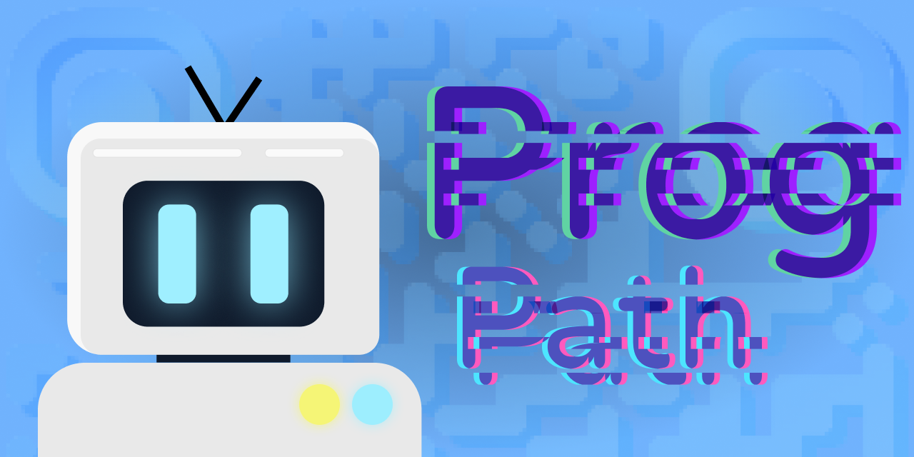
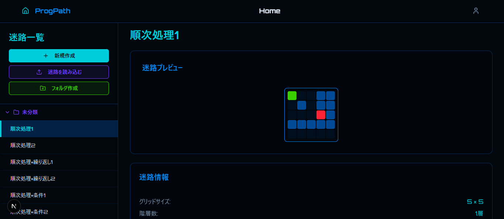
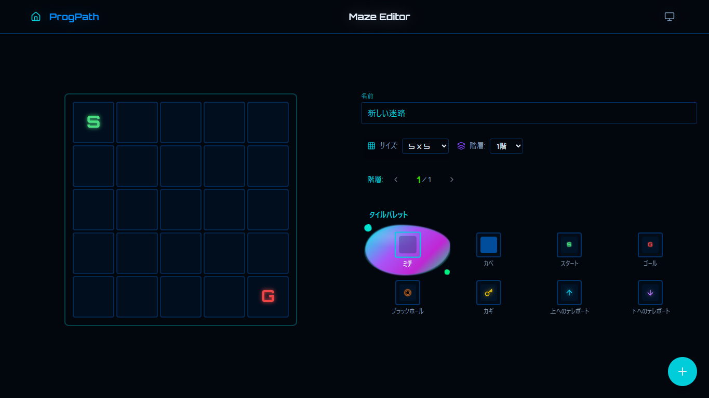
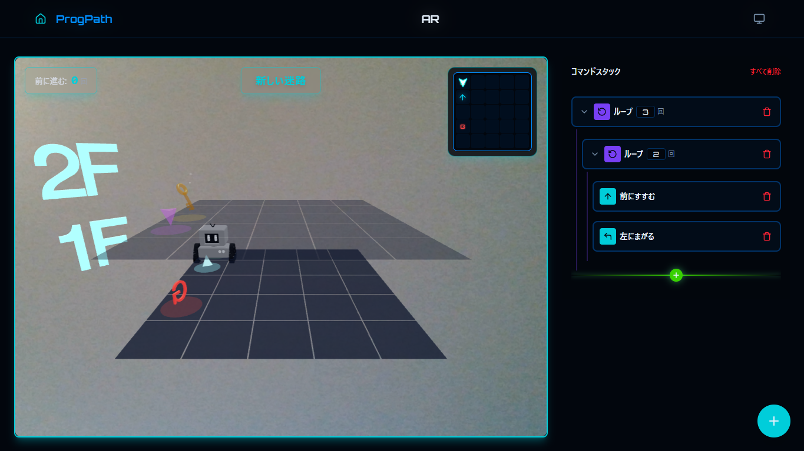
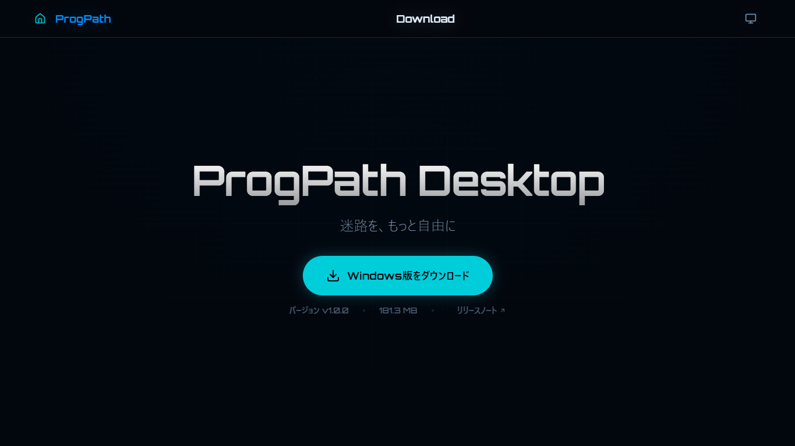
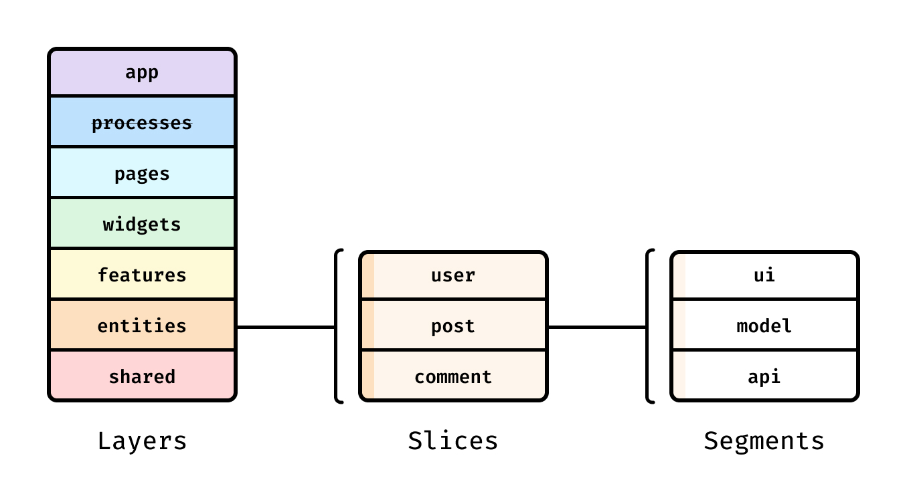

<div id="top"/>



<h1 align="center">🚀 ProgPath</h1>

<h3 align="center">「楽しみながら学ぶ」を形にする、小学生向けプログラミング教育導入アプリ</h3>

<h2 align="center">使用技術一覧</h2>
<!-- シールド一覧 -->
<p align="center">
  <a href="https://skillicons.dev">
    
  </a>
</p>

<p align="center">
  <a href="https://github.com/katsudon08/prog-path/blob/main/LICENSE">
    
  </a>
</p>

## サービスのURL
オフライン版をダウンロードしてプレイすることも可能です。

> https://prog-path.vercel.app/

<br/>

## サービス内で利用するQRコード
| **前にすすむコマンド** | **穴をうめる** | **ループコマンド** |
| :--: | :--: | :--: |
|  |  |  |

| **右にまがるコマンド** | **左にまがるコマンド** |
| :--: | :--: |
|  |  |

## サービス概要

本アプリケーションは、小学校高学年をターゲットとしたプログラミング教育導入アプリです。物理的なQRコードカードをカメラで読み取ることで、画面内の3Dロボットを操作し、迷路のゴールを目指します。

### 開発の背景と研究の目的
**「勉強」から「遊び」へ**
> プログラミングを「堅苦しい座学」として捉えるのではなく、遊びの中で「楽しい」という原体験を得られるアプリケーションを目指しました。
> 
> 小学校高学年の児童が夢中でプレイできるよう、ゲーム性を重視した設計を行っています。

**技術的転換による操作性と没入感の向上**
> 研究の引き継ぎ段階では「2Dマップ・ARマーカー方式」で実装されていましたが、教育現場での認識精度や動作の安定性を考慮し、「3Dマップ・QRコード方式」へと大幅に転換しました。 
> 
> このアップデートにより、ARマーカーよりも高い読み取り精度を確保しつつ、3Dモデルによるリッチな視覚表現を実現しました。結果として、児童がより直感的に、かつストレスなく操作できる環境を構築しています。

## アプリケーションのイメージ

| **ホーム画面** | **迷路作成・編集画面** |
| :---: | :---: |
|  |  |
| これまでに作った迷路を見たり、新しい迷路を作り始めたりする画面です。 | 画面をタップしてブロックを置くだけで、自分だけのオリジナル迷路をカンタンに作れます。 |

| **迷路実行画面** | **ダウンロード画面** |
| :---: | :---: |
|  |  |
| カメラに「コマンドカード（QRコード）」をかざして、ロボットをゴールまで導いてあげましょう。 | インターネットがない場所でも遊べるように、アプリをパソコンにインストールすることができます。 |

## 主な機能

### 🎮 迷路実行（AR体験）
- 「前に進む」、「右に曲がる」などのQRコードをカメラにかざすことで、直感的にプログラムを構築できます。
- Three.jsを用いた3Dロボットとアニメーションにより、児童の興味を惹きつけるUXを提供します。
- プログラミングの基礎である繰り返し処理（Loop）も物理カードで実装可能です。

### 🧩 迷路作成・共有
- 5×5から10×10までのサイズ変更や、最大5階の立体的な迷路を作成できます。
- 作成した迷路データはQRコードにエンコードして書き出し、他のユーザーと簡単に共有できます。

### 📂 管理機能
- 作成した迷路をフォルダごとに分類し、整理・保存することが可能です。

### 💻 デスクトップ版
- Electronを用いたデスクトップアプリケーションとして提供しています。
- Web版と同様の機能を利用できます。

## システムアーキテクチャ

### FSDアーキテクチャの採用



プロジェクトの保守性とColocationを高めるため、フロントエンドの設計手法として **Feature Sliced Architecture (FSD)** を採用しています。

### システム構成図


## セットアップ手順

### 必要環境
- Node.js
- npm

### インストール
1. リポジトリをクローンします。
```bash
git clone https://github.com/your-username/prog-path.git
cd prog-path
```

2. 依存関係をインストールします。
```bash
npm run install
```

### 実行方法

**Web版**
```bash
npm run dev
```

**デスクトップ版**
```bash
npm run electron:dev
```

**ビルド**
```bash
# Web版のビルド
npm run build

# デスクトップ版のパッケージング
npm run electron:build
```

<p align="center">
    (<a href="#top">トップへ</a>)
</p>