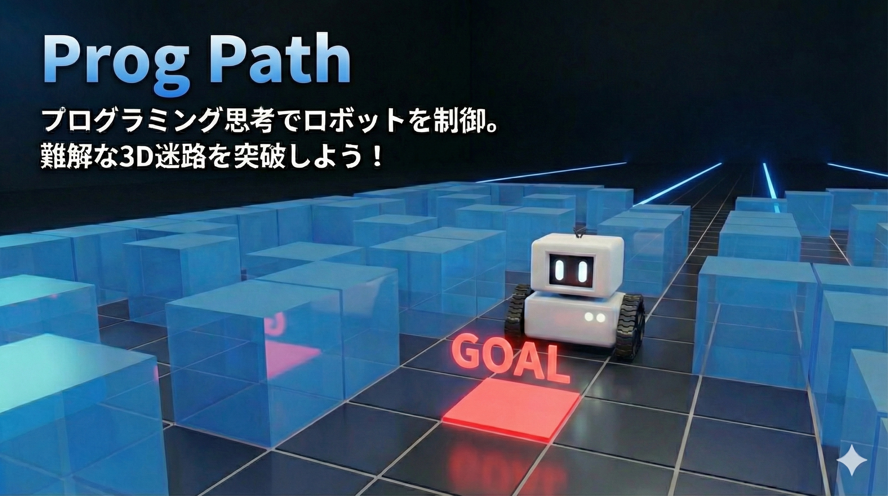
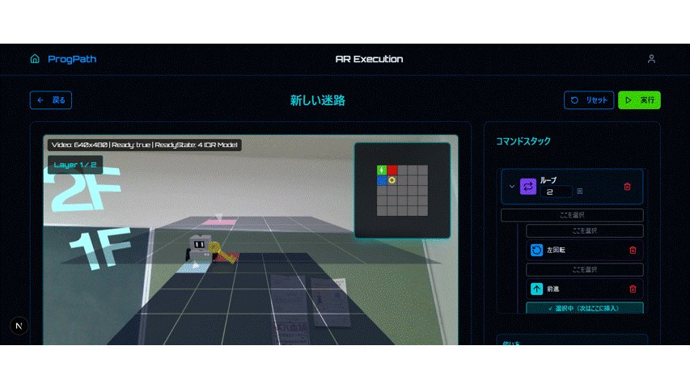
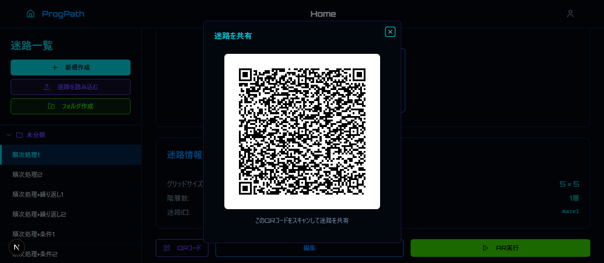
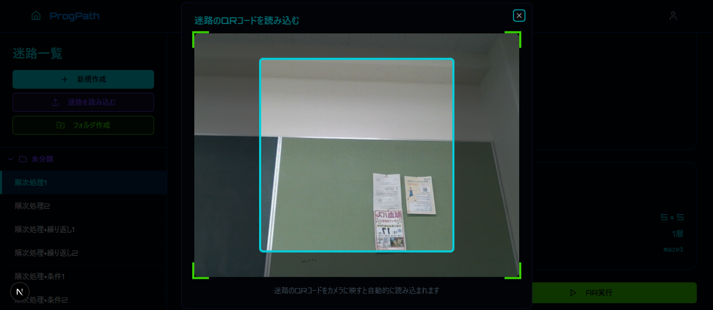
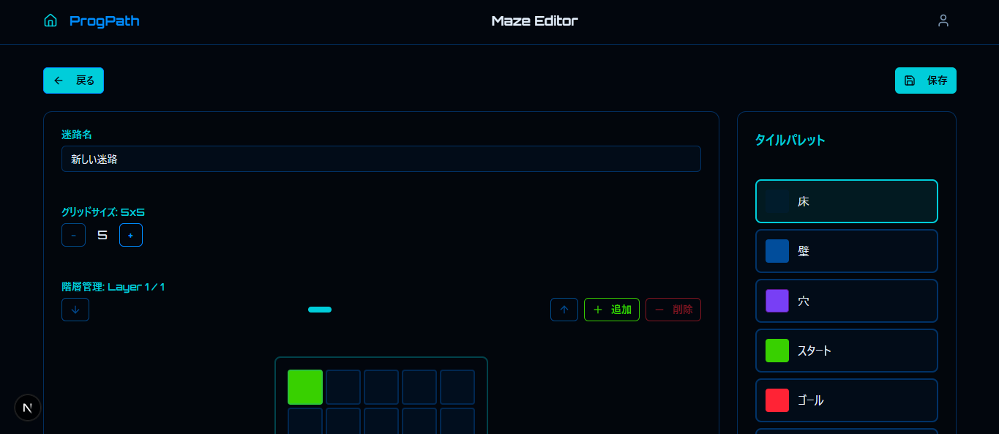
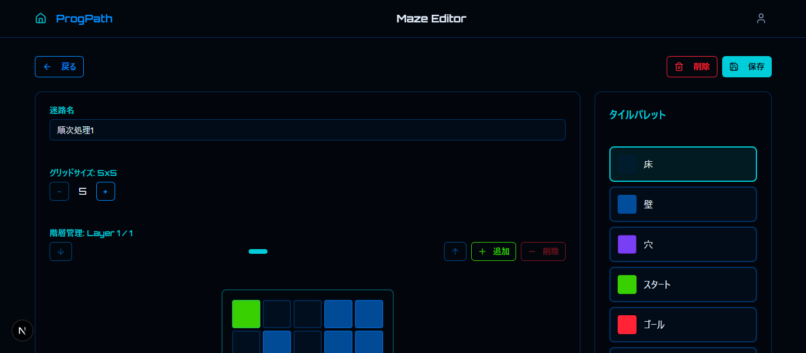
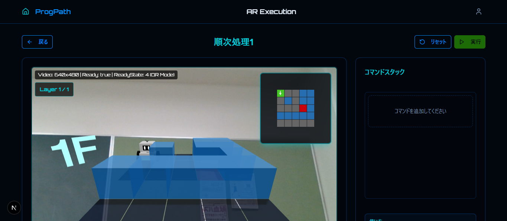

 

## サービスのURL
オフライン版をダウンロードしてプレイすることも可能です

> https://prog-path.vercel.app/

 

## サービス内で利用するQRコード
**前に進むコマンド**  
> 

**右に曲がるコマンド**  
> 

**左に曲がるコマンド**  
> 

**ループコマンド**  
> 

**穴を埋める**  
> 

 

## サービスについて
### サービス概要
本アプリケーションは、 **「楽しみながら学ぶ」** をコンセプトにした、小学校高学年向けのプログラミング教育導入アプリです。
以下の機能を提供しています。

> **基本機能**  
> 
> 物理的なカード（QRコード）をカメラで読み込むことにより、画面内の3Dロボットに命令を出し、迷路のゴールを目指します。

> **クリエイティブ機能**  
> 
> 既存のコースを攻略するだけでなく、ユーザー自身が迷路を自由に作成できる機能を搭載し、自由な発想を促します。

> **プラットフォーム**  
> 
> 学校現場と家庭、双方での利用を想定したクロスプラットフォーム設計（Web版・デスクトップ版）です。

### ターゲットと解決する課題
> **ターゲット**  
> 
> 小学校高学年の児童

> **解決する課題**  
> 
> 「勉強」の堅苦しさを排除し、遊びの中で **「プログラミング＝楽しい」** という原体験を提供します。

### 技術的な工夫とこだわり
同研究室の先輩から引き継いだ初期バージョン（2次元マップ（python）・ARマーカー方式）から、実用性とエンターテインメント性を高めるために以下の点において大幅なアップデートを行いました。

> **UXの向上（3D化）**  
> 
> 従来の2次元アプリから、3Dロボットとアニメーションを用いたリッチな表現へと進化させ、児童の興味・関心を惹きつけるUI/UXを実現しました。

> **ネットワーク環境への配慮**  
>
> 教育現場においてはデスクトップ版、家庭においてはWeb版を用いて、場所を選ばずにシームレスに利用できる環境を構築しました。

> **認識技術の転換（ARからQRへ）**
> 
> 開発過程でARマーカーのReactへの移行に技術的な課題が生じましたが、代替案としてQRコードを採用しました。  
結果として、ARマーカーよりも読み込み精度が向上し、より快適な操作性を実現することができました。

### 開発への想い・モチベーション
この研究開発の根底にあるのは、 **「ユーザー（児童）の笑顔」** です。 実際に開発したアプリを使って授業を行い、生徒一人ひとりからアンケートを取りました。
「楽しかった」「またやりたい」という肯定的な言葉や、夢中でプレイする姿が、開発を続ける最も強いモチベーションとなりました。

 

## アプリケーションのイメージ

 

## 機能一覧
| ホーム画面 |
| --- |
|  |
| 迷路作成、読み込み機能、迷路のプレビューとフォルダ機能を実装しました。 |

| 迷路共有モーダルウィンドウ | 迷路読み込みモーダルウィンドウ |
| --- | --- |
|  |  |
| 迷路情報をQRコードにエンコードして共有する機能を実装しました。 | QRコードを読み込むことで迷路を読み込む機能を実装しました。 |

| 迷路作成画面 | 迷路編集画面 |
| --- | --- |
|  |  |
| 迷路を作成する機能を実装しました。 | 迷路を編集する機能を実装しました。 |

| 迷路実行画面 | デスクトップ版ダウンロード画面 |
| --- | --- |
|  |  |
| 迷路を実行する機能を実装しました。 | デスクトップ版をダウンロードする機能を実装しました。 |

 

## 使用技術
| Category | Technology Stack |
| --- | --- |
| Frontend | Next.js, TypeScript |
| Styling | Tailwind CSS, tailwindcss-animate |
| UI Component | Radix UI, Lucide React, cmdk |
| 3D | three.js, react-three/fiber, react-three/drei |
| QR | jsqr, qrcode.react |
| desktop | electron, electron-builder, electron-serve |
| Deployment | Vercel |

 

## システム構成図

**構成の特徴:**
- **クロスプラットフォーム**: Web版（Vercel）とデスクトップ版（Electron）の両方をサポート
- **物理的インタラクション**: QRコードカードをカメラで読み取り、直感的な操作を実現
- **リッチな3D体験**: Three.jsによる3Dロボットと迷路のビジュアライゼーション
- **オフライン対応**: デスクトップ版ではネットワーク不要で動作
- **データ共有**: 作成した迷路をQRコードで共有可能

 

## 今後の展望
- 小学校で使用する実機において、動作が重い・バグが頻発しているので、より軽量なアプリケーションを目指します。
- プログラミング教育を意識して、最小のコマンド数でクリアを目指すための仕組みづくりを行います。
- 迷路のQRエンコードを圧縮して、より短いQRコードを生成するようにします。
- 本アプリの保守性を高めるために、インフラやディレクトリ設計、コード品質を向上させます。