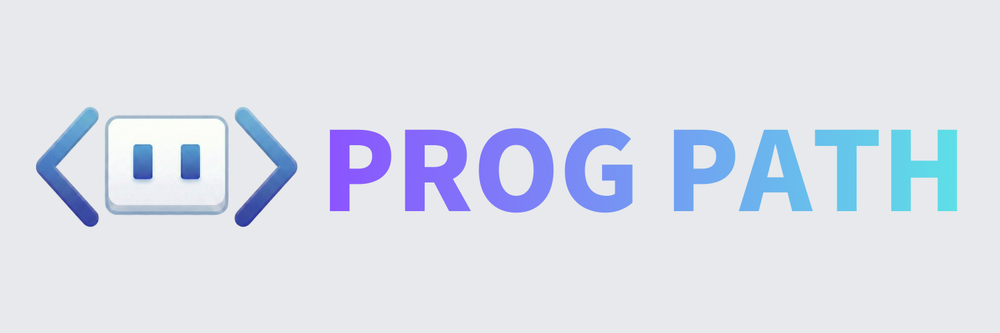

<h1 align="center">ProgPath</h1>

<!-- シールド一覧 -->
<p align="center">
  <a href="https://skillicons.dev">
    
  </a>
</p>

<p align="center">
  <a href="https://github.com/katsudon08/prog-path/blob/main/LICENSE">
    
  </a>
</p>

## 概要

ProgPathは**小学校高学年の児童**が、**QRコードカード**を使った物理的な操作と**AR技術**を組み合わせ、**2人1組**で協力しながら**プログラミング的思考**を学ぶWeb/デスクトップアプリケーションです。 <br>

カメラでQRコードを読み取ってロボットを動かすフローチャートを構築し、3D迷路内でシミュレーション実行することで、児童間の対話を促進し、**楽しくプログラミングを学べる環境**を提供します。

## 主な機能

- **QRコード読み取り**: カメラでQRコードが印刷されたカードをスキャンし、コマンドを認識
- **フローチャート構築**: 読み取ったコマンド（前にすすむ、右にまがる、左にまがる、穴をうめる、ループ）を組み合わせてプログラムを作成
- **AR風3Dシミュレーション**: React Three Fiberを使い、カメラ映像上で3Dロボットが迷路を動くシミュレーションを表示
- **結果フィードバック**: 実行結果を確認し、児童が話し合いながら修正できる仕組み

## サービスのURL

- [ProgPath](https://prog-path.vercel.app/)

## サービス内で利用するQRコード

|              **前にすすむ**               |            **右にまがる**             |           **左にまがる**            |           **穴をうめる**            |             **ループ**              |
| :---------------------------------------: | :-----------------------------------: | :---------------------------------: | :---------------------------------: | :---------------------------------: |
|  |  |  |  |  |

## 前提条件

- Windows 11
- Node.js v24.13.0 以上
- npm v11.8.0 以上
- Visual Studio Build Tools 2026
- rustup v1.28.2 以上

## セットアップ手順

1. リポジトリをクローン

```bash
   git clone https://github.com/katsudon08/prog-path.git
   cd prog-path
```

2. 依存関係をインストール

```bash
   npm install
```

3. 開発サーバーを起動

```bash
   npm run dev
```

4. Tauriアプリケーションを起動

```bash
   npx tauri dev
```
