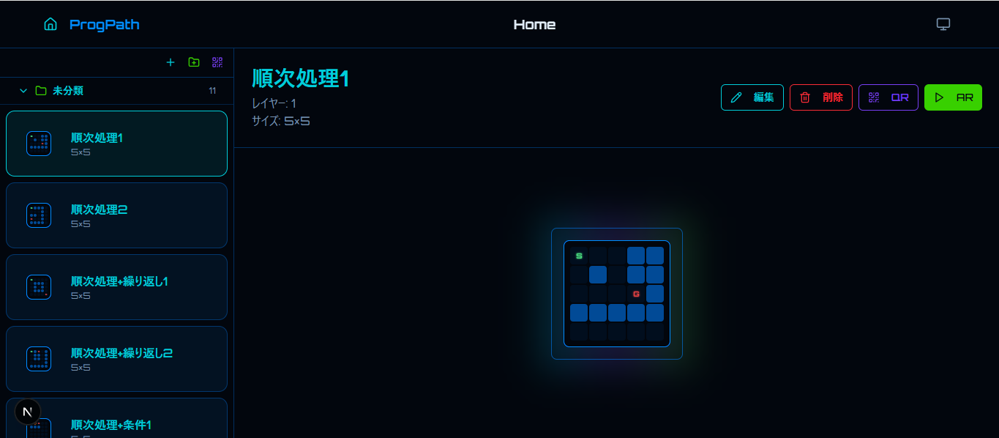
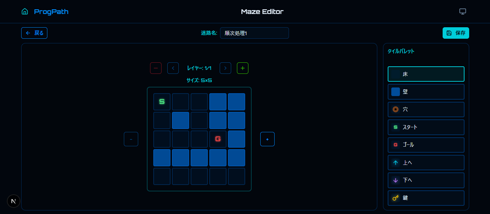
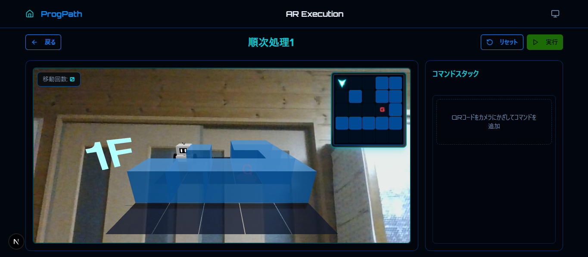
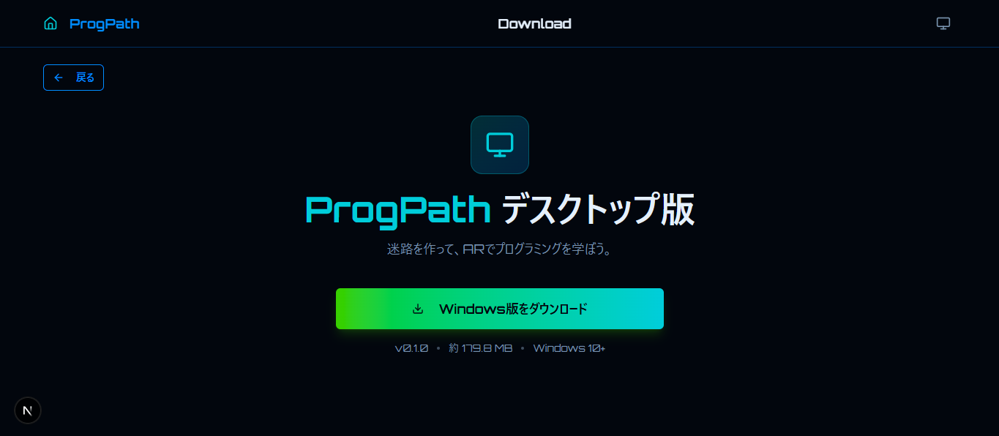

# 設計

## ドメイン

> アプリケーションにおけるページ単位での機能

ホーム画面

- 本アプリのホーム画面

---

迷路作成・編集画面

- 迷路の作成/編集を行うことができる

---

迷路実行画面

- 迷路をARで実行することができる(QRコードを撮影して迷路を実行することができる)

---

本アプリのオフライン版ダウンロード画面

- 本アプリのオフライン版(デスクトップ版)をダウンロードすることができる

---

## 機能

> ドメインにおける小さな機能単位

### 共通

| 機能名 | 説明 |
| --- | --- |
|  navbar | ・ホーム画面へ遷移するアイコンボタン   ・アプリ名(ProgPath)表示   ・現在ページ名表示  　ホーム画面：Home / 迷路作成画面：Maze Create / 迷路編集画面：Maze Edit / ダウンロード画面：Download をそれぞれ表示   ・ダウンロード画面へ遷移するアイコンボタン |
| maze-preview | 指定した階層の迷路を上から見た2Dプレビューを表示（設置する場所に合わせてサイズをスケーリング可能） |
| maze-crud | ・迷路データをlocalstorageで管理   ・[迷路ID、迷路名、迷路のサイズ、迷路の3次元配列、その迷路が格納されているフォルダ（規定値は未分類）]を格納するキーを定義   ・迷路の作成/編集/削除を行う   ・迷路データを格納しているキーの値が不正な迷路データや空配列になっている場合はそれを上書きする形で初期迷路を保存する |
| common | 共通のUIや関数、hooksなどをここで定義する |

### ホーム画面

| 機能名 | 説明 |
| --- | --- |
| side-header | ・迷路作成画面へ遷移するアイコンボタン   ・`folder-create-dialog`を表示するアイコンボタン   ・`qr-import`を表示するアイコンボタン |
| maze-data | ・スタートタイルが存在する階層の`maze-preview`を表示   ・迷路名表示   ・迷路のサイズ表示   ・選択されている場合は、その`maze-data`の迷路を`main-content`で表示する   ・ドラッグ＆ドロップで`folder`間で移動可能で、ドロップ先の`folder`の`maze-list`に移動する |
| maze-list | `maze-data`を一覧表示する迷路リスト |
| maze-delete-dialog | ・迷路削除確認ダイアログ   ・対象の迷路を削除するかどうかを確認し、削除する場合は対象の迷路を削除する |
| folder | ・`maze-list`を格納するフォルダ   ・折りたたみ/展開可能(デフォルトでは折りたたまれている状態)   ・フォルダ名表示（未分類フォルダは必ず存在させ、どれにも分類しない迷路は未分類に格納）  ・フォルダ名をダブルタップすることでフォルダ名を変更できる（未分類フォルダのみ名前の変更不可）   ・フォルダ内の迷路数表示   ・`folder-delete-dialog`を表示するアイコンボタン（未分類フォルダには削除ボタンが存在しない） |
| folder-list | `folder`を一覧表示するフォルダリスト |
| folder-create-dialog | ・フォルダ作成ダイアログ   ・フォルダ名を入力し、新しい`folder`を作成する |
| folder-delete-dialog | ・フォルダ削除確認ダイアログ   ・対象の`folder`を削除するかどうかを確認し、削除する場合は対象の`folder`を削除する |
| main-header | ・迷路名表示   ・迷路の階層表示   ・迷路のサイズ表示   ・迷路編集画面へ遷移するボタン   ・迷路を削除するための`maze-delete-dialog`を表示するボタン   ・`qr-share`を表示するボタン   ・AR実行画面へ遷移するボタン |
| main-content | 2層以上の迷路の場合、階層を切り替えることができる   ・その階層の`maze-preview`を表示   ・迷路データがlocalstorageに一つも存在しない場合、新しく迷路を作成するように促す案内UIを表示 |
| qr-import | ・QRコードをスキャンして迷路を読み込むためのカメラ映像ダイアログを表示   ・QRコードをスキャンして迷路を読み込み、迷路をlocalstorageに追加 |
| qr-share | ・迷路データをQRコードに変換して表示するダイアログ   ・このQRを`qr-import`で読み込むと、迷路をlocalstorageに追加できる |

### 迷路作成・編集画面

| 機能名 | 説明 |
| --- | --- |
| switch | ・遷移元のボタンで迷路の作成か編集化を切り替えることが可能（UIが全く同じため）   ・作成の場合は新しくlocalstorageに迷路データを追加し、編集の場合は編集を行う迷路データを更新する |
| header | ・ホーム画面に遷移するボタン   ・迷路名を変更するフォーム（迷路を作成する場合は新しい迷路がプレースホルダーとなっており、迷路を編集する場合は、対象の迷路名がプレースホルダーになっている）   ・迷路を保存するボタン（迷路作成の際はlocalstorageに迷路データを追加し、迷路編集の際は編集を行う迷路データを更新する） |
| floor | ・迷路の階層を増減させる（1から5階まで）   ・迷路の階層を切り替える   ・現在の階層を表示   ・`maze`の真上に表示 |
| size | ・迷路のサイズを増減させる（5×5～10×10）   ・現在の迷路のサイズを表示   ・`maze`の左右に表示（`maze`基準に上下中央ぞろえ） |
| grid | ・迷路を構築するグリッド編集（迷路のマスに選択している`tile`を配置することができる）   ・迷路のタイルを配置し、編集を行うことができる。   迷路の作成時は1階で左上にスタートタイル、右下にゴールタイルが初期配置となっている   ・`floor`と`size`で迷路の階数とサイズの制御を行う |
| tile | ・`grid`に設置することができるタイルのボタン   ・現在選択している`tile`を`grid`に設置することができ、下記の種類が存在する     ・床：迷路の床   ・壁：迷路の壁   ・穴：ここを通ると、穴に落ちてゴール失敗となる   ・スタート：迷路のスタート（迷路に一つしか存在できない）   ・ゴール：迷路のゴール（迷路に一つしか存在できない）   ・上へ（テレポートタイル）：上の階層にテレポートすることができる（上に階が存在しない場合/上の階層の同じ位置のタイルが壁、穴、テレポートタイルの場合、その内容に応じた`error-dialog`を表示する）   ・下へ（テレポートタイル）：下の階層にテレポートすることができる（下に階が存在しない場合/下の階層の同じ位置のタイルが壁、穴、テレポートタイルの場合、その内容に応じた`error-dialog`を表示する）   ・カギ：ゴールする際に、設置されているすべてのカギを拾わないと、ゴールすることができない |
| tile-pallet | ・`tile`を一覧表示するパレット |
| error-dialog | ・迷路編集時に、上階または下階のタイルが壁、穴、テレポートタイルの場合、その内容に応じたエラーメッセージを表示するダイアログ |

### AR実行画面

| 機能名 | 説明 |
| --- | --- |
| header | ・ホーム画面へ遷移するボタン   ・迷路名を表示   ・ロボットの位置をスタート位置にリセットするボタン   ・`command-stack`にある`command`を順次実行し、ロボットを動かすボタン（実行前に必ずスタート位置にロボットをリセットする）|
| camera | ・カメラ映像を表示   ・QRコードを読み取り、対応するコマンドの`command-dialog`でコマンド名を表示する   ・読み取ったQRコードの対応する`command`を`command-stack`に追加（選択している位置に） |
| maze-3d | ・迷路を3Dで表示   ・`camera`と重ねてARのように表示する   ・迷路の階層を3Dテキストで表示   ・スタート、ゴール、床、壁、カギ、穴、テレポートタイルをそれぞれ適切な3Dモデルで表示 |
| robot-3d | ・ロボットを3Dモデルで表示   ・`camera`と重ねてARのように表示する   ・「前に進む」/「右に曲がる」/「左に曲がる」/「穴をうめる」/「穴に落ちる」それぞれのアニメーションを対応するコマンドや状況で実行   ・ロボットの向きを(1,0/0,1/-1,0/0,-1)で管理し、ロボットが存在する階層も1から5で管理   ・ロボットは1マスずつ移動し、一つの`command`で一つの行動を行う |
| move-count | ・ロボットが進んだマスの数をカウントし、`camera`の左上にオーバーレイする形で表示 |
| mini-map | ・俯瞰視点のミニマップ   ・ロボットが存在する階層の`maze-preview`を表示し、ロボットの位置を合わせて表示する   ・ロボットの動きに合わせて`mini-map`も更新する（ロボットの位置やテレポート後の階層など）   ・`camera`の右上にオーバーレイする形で表示 |
| command | ・それぞれのコマンドに対応するアイコン、コマンド名、`command`削除ボタン   ・下記の文字列に対応するQRコードを読み取り、実行することでロボットに対応する行動を取らせることができるコマンド     ・forward：前にすすむ   ・turnRight：右にまがる   ・turnLeft：左にまがる   ・ifHole：穴をうめる   ・loop：ループ     ・前にすすむコマンドはロボットが現在向いている向きに1マス進めるコマンド   ・右にまがる/左にまがるコマンドはロボットの向きをそれぞれ右/左に90度回転させるコマンド   ・穴をうめるコマンドはロボットが現在向いている向きに穴が存在したら、穴をうめるコマンド   ・ループコマンドは読み込まれると、`loop-dialog`で回数を入力し、もう一度loopコマンドを読み込むまでの間に他のコマンドを読み込んだコマンド群を指定回数分、順次実行することができる   ・ループコマンド構築中（1回だけループコマンドを読み込む）にコマンドを削除するとループコマンド構築が解除され、ループコマンドの中にネストしていたコマンド群もすべて削除される   ・`command`の下には位置選択ボタンが配置されており、選択いた位置に`command`を`camera`で読み取って追加することができ、ループ内`command`にも同様に位置選択ボタンが配置されている   ・通常は一番下が位置選択されているのがデフォルトで、ループコマンド構築中はループコマンドの中にネストしているコマンドの一番下がデフォルトの選択位置となっている（ループコマンド構築中はループコマンドの中以外に`camera`で読み込んで`command`を追加することはできない） |
| command-stack | ・`command`を一覧表示する   ・現在のロボットが行動している`command`に合わせて対応する`command`を発光させて、常に一番上にくるようにオートスクロールを行う |
| command-dialog | ・`camera`により、QRコードを読み取って`command`を追加する際に、`camera`の上下左右中央ぞろえでオーバーレイする形で数秒表示する   ・それぞれの`command`に対応する表示を行い、下記の通りである     ・前にすすむ：Forward   ・右にまがる：Turn Right   ・左にまがる：Turn Left   ・穴をうめる：If Hole   ・ループ：Loop   ・`command-stack`から`command`削除時：Command Delete |
| loop-dialog | ・`camera`でループコマンドのQRが読み込まれた際に、ループ回数を入力するダイアログ   ・このダイアログが表示されている間は`camera`で読み込まれたQRコードを`command`として追加することはできない   ・全体画面の上下左右中央ぞろえでオーバーレイする形で表示する |
| success-dialog | ・ゴールタイルに到達することができた際に、表示されるダイアログ   ・`move-count`の値でゴールすることができたことを表示   ・`camera`の上下左右中央ぞろえでオーバーレイする形で表示 |
| failure-dialog | ・下記の例に応じたエラーメッセージを表示するダイアログ   ・表示する際に少し揺れるようにアニメーションする   ・`camera`の上下左右中央ぞろえでオーバーレイする形で表示     ・ロボットが壁にぶつかった時   ・ロボットが穴に落ちたとき   ・ロボットがゴールに到達したときに迷路内のすべてのカギを取得してゴールしなかったとき   ・ロボットが`command-stack`の`command`を順次実行してゴールに到達できなかった時 |

### ダウンロード画面

| 機能名 | 説明 |
|------|------|
| header | ・ホーム画面に遷移するボタン（左端） |
| icon | ダウンロードを示すアイコン |
| title | "ProgPath デスクトップ版"というテキスト |
| description | "ProgPath デスクトップ版"の説明文 |
| download-button | ・"Windows版をダウンロード"というテキストのボタン   ・ProgPathのデスクトップ版をGitHub Releasesからダウンロードする   ・Electronを検出し、Electronの場合はダウンロードできないようにし、その旨のテキストを表示 |
| information | GitHub Releasesから取得した最新バージョンの情報とダウンロードファイルの容量を表示するテキスト |