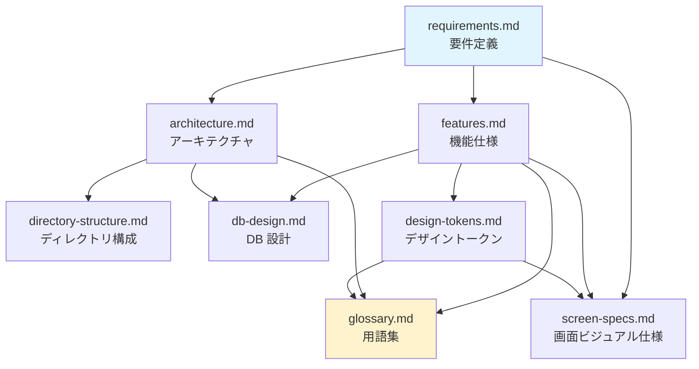

# ProgPath ドキュメント

ProgPath（再開発版）の設計ドキュメント群の索引。各ドキュメントへのリンク・概要・推奨する読む順序を示す。

- 本プロジェクトは**ゼロから全面再開発中**。記述の正は to-be 設計。
- リポジトリ運用（Git・コミット規約・開発フロー）は [../CLAUDE.md](../CLAUDE.md) を参照。

---

## 読む順序

初めて読む場合は、上位（何を作るか）から下位（どう作るか）へ進むのが分かりやすい。

1. **[requirements.md](./requirements.md)** — 何を・なぜ作るか（全体の源泉）
2. **[features.md](./features.md)** — 画面ごとに何ができ、どう振る舞うか
3. **[screen-specs.md](./screen-specs.md)** — その画面を何 px でどう並べるか
4. **[architecture.md](./architecture.md)** — どの技術で・どう組み立てるか
5. **[directory-structure.md](./directory-structure.md)** — コードをどこに置くか
6. **[db-design.md](./db-design.md)** — 何を・どう永続化するか
7. **[glossary.md](./glossary.md)** — 用語の統一定義（随時参照）

> `glossary.md` は通読より、他ドキュメントを読む際の**逆引き辞書**として使う。

---

## ドキュメント一覧

| ドキュメント | 概要 |
| --- | --- |
| [requirements.md](./requirements.md) | 要件定義。利用前提・対象ユーザー・中心価値・機能/非機能要件・成功指標・スコープ外。 |
| [features.md](./features.md) | 機能仕様。ホーム/迷路編集/AR実行/ダウンロードの画面別の振る舞いと確定ドメインルール。 |
| [screen-specs.md](./screen-specs.md) | 画面ビジュアル仕様。設計基準ビューポート（1280×600）・タイポ階層・4画面 + navbar のレイアウト/寸法/情報量と、その認知負荷上の根拠。 |
| [architecture.md](./architecture.md) | アーキテクチャ設計。システム構成図・技術スタックの責務・FSD 規則・データフロー・3D/AR 方式。 |
| [directory-structure.md](./directory-structure.md) | ディレクトリ構成。`src/` 配下のレイヤー/スライス/セグメントと Public API 方針。 |
| [db-design.md](./db-design.md) | DB 設計。迷路・フォルダのデータモデル・Zod スキーマ・TanStack DB/SQLite(WASM+OPFS)・QR シリアライズ。 |
| [glossary.md](./glossary.md) | 用語集。ドメイン・コマンド・タイル種別・FSD・技術スタックの統一定義。 |
| [design-tokens.md](./design-tokens.md) | デザイントークン。配色（ライト/ダーク）・タイポ・スペーシング・タップ最小サイズ・タイル/コマンドの識別色とアイコンの統一定義。 |

---

## ドキュメントの関係

- `requirements.md` が全体の源泉。
- `features.md`（ドメインの振る舞い）と `architecture.md`（構造）が中核で、`directory-structure.md` と `db-design.md` を導く。
- `glossary.md` は全体の用語を集約する横断的な参照。
- `design-tokens.md` は `features.md` のビジュアル方針を受け、タイル/コマンドの識別子で `glossary.md` と対応する。
- `screen-specs.md` は「何が起きるか」（`features.md`）と「どのトークンを使うか」（`design-tokens.md`）を受けて、**何 px でどこに置くか**を確定する。振る舞いと色は持たない。

---

## メンテナンス方針

- ドキュメントの作成・編集・実装との同期は `docs` skill で行う（[../CLAUDE.md](../CLAUDE.md) 参照）。
- 記述の正は to-be 設計。実装変更時は該当ドキュメントを同期する。
- 〔要確認〕が付いた値・挙動は暫定。実機検証・運用で確定させる。
