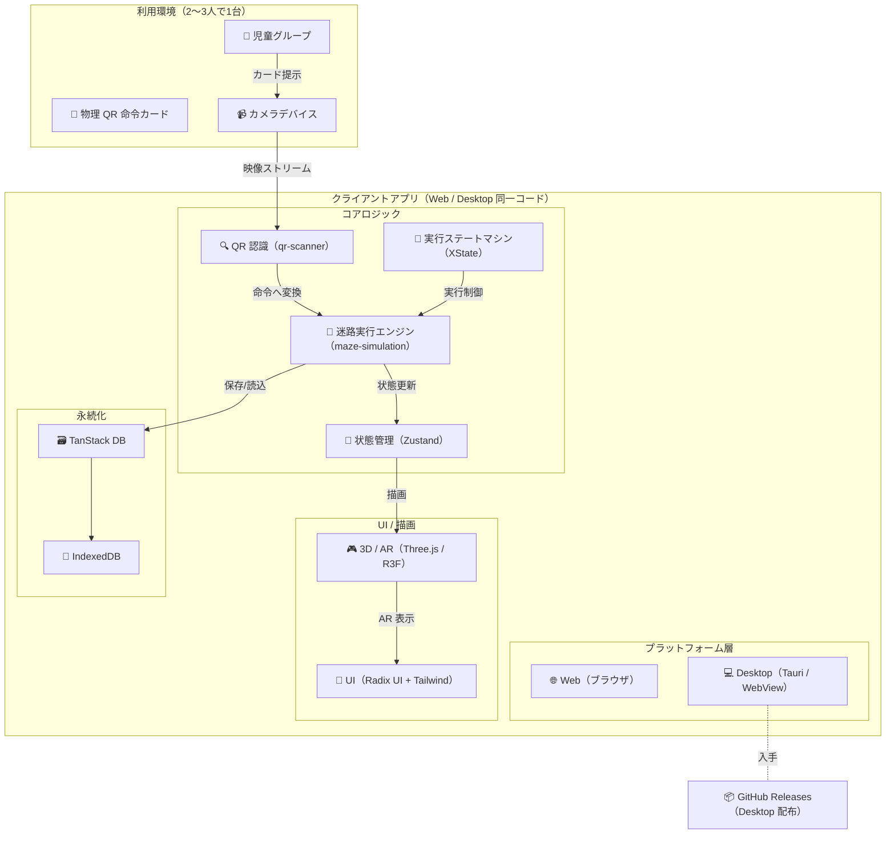
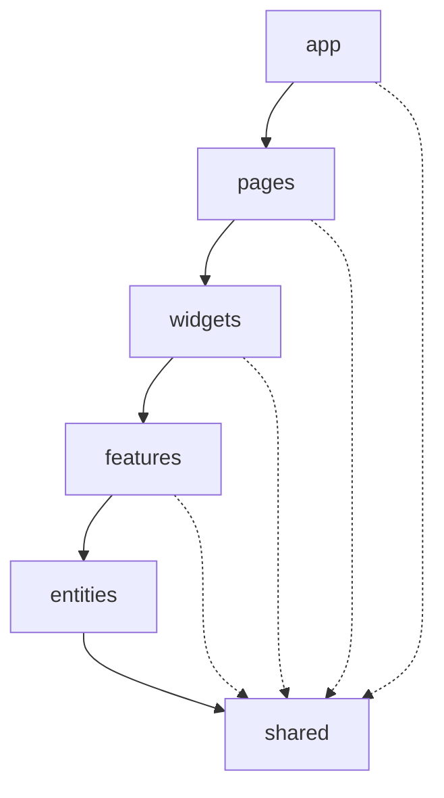
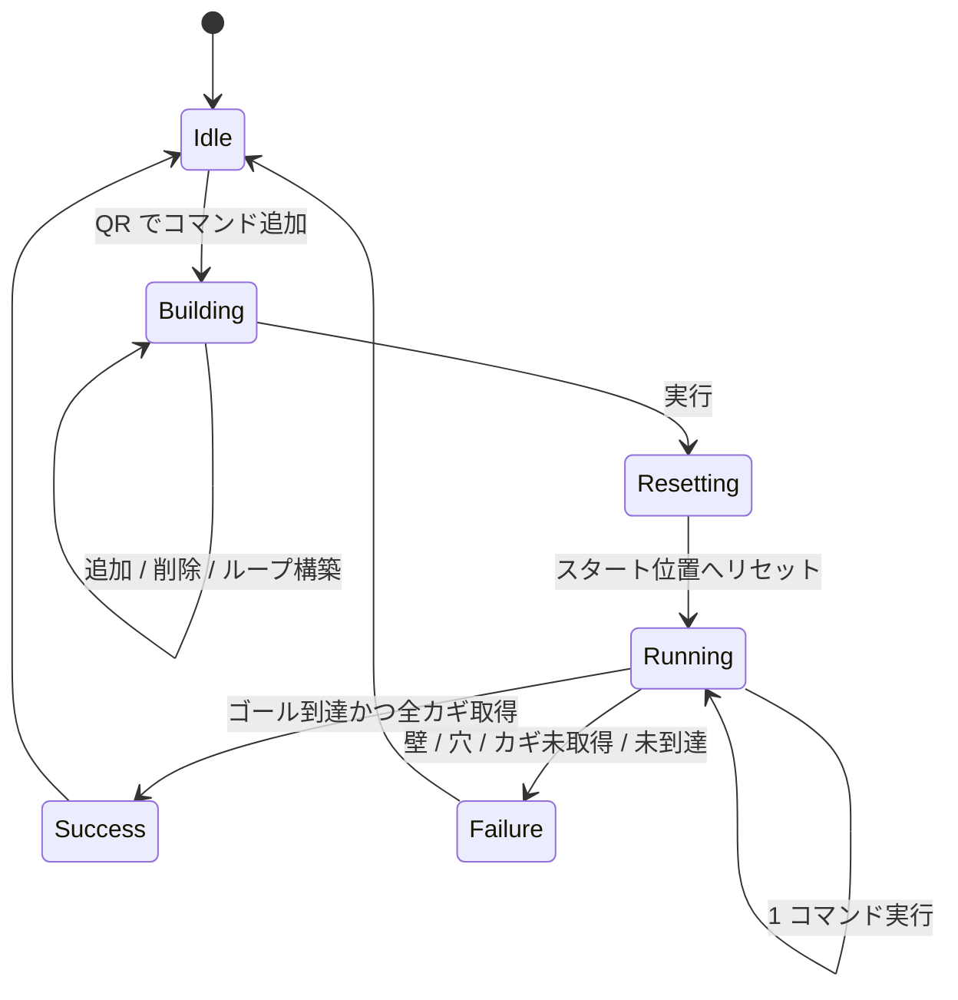

# アーキテクチャ設計

ProgPath（再開発版）の**システム構成・技術スタックの役割・FSD アーキテクチャ・データフロー・3D/AR 方式・プラットフォーム留意点**を定義する。実装の構造的判断の拠り所とする。

- 対象読者: 新規開発者、および設計判断の参照者（人・AI）。
- 記述の方針: レイヤー/依存規則とスタックの責務に集中する。**スライス単位のディレクトリ詳細は [directory-structure.md](./directory-structure.md) に委ねる**。
- 上位要件は [requirements.md](./requirements.md)、画面別の振る舞いは [features.md](./features.md) を正とする。
- 既存実装（Next.js + Electron + LocalStorage + jsqr + Vercel）は破棄し、to-be に引き直す。

> 〔要確認〕が付いた値・挙動は暫定。実機検証・運用で確定させる。

---

## 1. 全体アーキテクチャ

ローカル完結のクライアントアプリ。Web（ブラウザ）と Desktop（Tauri）で**同一の機能・体験**を提供する。サーバー・クラウド同期は持たない（→ [requirements.md](./requirements.md) 7）。

- データ・命令はすべて端末内で処理する。ネットワークは Desktop 版の入手導線でのみ関与する。
- カメラ映像を背景に 3D を重畳する AR 方式（→ [6](#6-3d--ar-方式)）。

---

## 2. 技術スタックと役割

各技術の責務を一意に定める。バージョン固定の正は mise に置く（→ [CLAUDE.md](../CLAUDE.md)）。

| 領域 | 採用 | 役割 |
| --- | --- | --- |
| 言語 | TypeScript | 全コード。`any` 禁止（→ コーディング規約） |
| UI | React | コンポーネント記述 |
| UI 部品 | Radix UI + Tailwind CSS | アクセシブルな部品 + ユーティリティ CSS |
| 3D / AR | Three.js（React Three Fiber） | 迷路・ロボットの 3D 描画、カメラ映像への重畳 |
| QR 認識 | **qr-scanner**（jsQR を Web Worker でラップ） | カメラ映像から QR をデコード。Worker でメインスレッド（3D 描画）を塞がない |
| 状態管理 | Zustand | アプリ全体の状態 |
| 複雑な遷移 | XState | **AR 実行フロー**の明示的ステートマシン（→ [5.2](#52-状態管理の方針)） |
| バリデーション | Zod | 入力・QR・永続データのスキーマ検証 |
| DB アクセス | TanStack DB | 永続データへのリアクティブアクセス |
| ローカル DB | IndexedDB | 迷路・フォルダの永続化 |
| デスクトップ | Tauri | Desktop 配布（WebView ベース） |
| ツールチェーン | Vite+（vp） | dev/build・lint/format・型チェック・テスト・パッケージング |
| 環境管理 | mise | ランタイム固定 + タスク実行の入口 |
| パッケージ管理 | pnpm | 依存解決 |

> **QR 認識ライブラリ（qr-scanner）は本書での新規決定**。全環境で同一挙動・QR 特化・軽量で低スペック端末（→ [requirements.md](./requirements.md) 5.3）に適すると判断した。CLAUDE.md の技術スタック表にも反映済み。

### 2.1 ツールチェーンの住み分け

- **mise**: 言語ランタイム・CLI ツールのバージョン固定と、タスク実行の入口（`mise run <task>`）。
- **pnpm**: 依存解決。
- **vp（Vite+）**: ビルド・lint・format・型チェック・テストの実体。
- 各 `mise` タスクの中身が `pnpm` / `vp` を呼ぶ構成にする。

---

## 3. FSD アーキテクチャ

Feature-Sliced Design を厳守する。

### 3.1 レイヤーと依存方向

レイヤーは上位→下位の一方向のみ依存する。逆流・循環は厳禁。

| レイヤー | 責務 |
| --- | --- |
| `app` | 全体初期化・プロバイダ・ルーティング・グローバル設定 |
| `pages` | 画面（ホーム / 迷路編集 / AR 実行 / ダウンロード）の組み立て |
| `widgets` | 複数 feature/entity を束ねた独立した画面ブロック |
| `features` | ユーザー価値を生む機能単位（迷路編集・命令作成・迷路実行 など） |
| `entities` | ドメインの中核オブジェクト（maze / robot / command / folder） |
| `shared` | レイヤー非依存の共通 UI・ユーティリティ・型・抽象 |

### 3.2 依存規則

- **上位→下位の一方向のみ**。下位は上位を知らない。
- **同一レイヤー内の直接参照は禁止**（例: `entities/robot` → `entities/maze`）。必要なら上位（features 等）で組み合わせるか、`shared` へ抽出する。
- **Public API**: 他スライスからの import は必ずスライス直下の `index.ts` 経由。`export * from` は避け、公開対象を明示する。

> これらの規則は **dependency-cruiser** で自動強制する（`mise run lint:fsd`）。レイヤー逆流・同一レイヤー横断・Public API 迂回（index 非経由の深い import）をエラー検出する（`@/` エイリアスとディレクトリ→index は tsconfig の paths 経由で解決）。全プロジェクト走査のため push 前（lefthook の pre-push）に実行し、CI でも実行する（設定: `.dependency-cruiser.js` / → Issue #167・CI 連携は #173）。

### 3.3 セグメント

各スライスは以下のセグメントを持つ（`api` は任意）。

| セグメント | 内容 |
| --- | --- |
| `ui` | コンポーネント・見た目 |
| `model` | 状態・型・ビジネスロジック |
| `lib` | スライス内ユーティリティ |
| `api`（任意） | 外部 I/O |

### 3.4 ロジックと UI の分離

- 純粋な遷移・計算ロジックは `ui` を持たない `model` / `lib` に集約する。
- 実行は**明示的なステートマシン**で表現する（AR 実行フロー = XState）。
- 高頻度更新（3D アニメーション）は React 状態を経由せず `useFrame` 内で ref を直接操作する（→ [6.2](#62-r3f-の方針)）。

---

## 4. ドメインとスライス配置

エンティティと、それらをまたぐ機能の配置方針。**スライスの完全な一覧・内部構成は [directory-structure.md](./directory-structure.md) を正とする**。本章は配置の設計判断のみを示す。

### 4.1 エンティティ（entities）

各エンティティは自身の純粋ロジック（型・状態・計算）のみを持つ。**相互参照しない**。

| エンティティ | 中核の関心事 |
| --- | --- |
| `maze` | 迷路の構造（階層・サイズ・タイル配置）、タイル種別 |
| `robot` | ロボットの位置・向き・階層・取得済みカギ |
| `command` | コマンド種別と、ループのネスト構造（loopStart/loopEnd） |
| `folder` | 迷路の分類（未分類フォルダを含む） |

### 4.2 複数エンティティをまたぐロジックの配置

> **設計判断**: 迷路実行（コマンド列を解釈してロボットを迷路上で動かし、成功/失敗を判定する）は maze / robot / command をまたぐ。FSD 原則どおり**複数エンティティの合成は上位レイヤーで行う**ため、`features/maze-simulation` に実行エンジンを置く。各エンティティはそのための純粋ロジックのみを提供する。

主な features（詳細は directory-structure.md）:

- `features/maze-simulation` — 迷路実行エンジン（コマンド解釈・移動・衝突/落下/カギ/ゴール判定）。AR 実行フローの XState もここ。
- `features/command-management` — QR からの命令作成・スタック構築・ループのネスト管理。
- `features/maze-edit` — グリッド編集・タイル配置・整合チェック。
- `features/maze-management` / `features/folder-management` — 迷路・フォルダの CRUD。
- `features/maze-qr-management` — 迷路の QR 共有（エクスポート/インポート）。
- `features/app-download` — Desktop 版の入手導線。

---

## 5. データフローと状態管理

### 5.1 命令作成〜実行のフロー

1. **命令作成**: カメラ映像 → `qr-scanner` がデコード → `command` に変換し、コマンドスタックへ追加（ループは loopStart/loopEnd ＋スタックでネスト管理。→ [features.md](./features.md) 5.3）。
2. **実行**: `maze-simulation` がスタックを先頭から解釈し、`robot` を 1 コマンド = 1 行動で動かす。実行前にスタート位置・初期向き（固定）へリセット。
3. **判定**: 壁衝突 / 穴落下 / カギ未取得でゴール / コマンド尽きで未到達 → 失敗。全カギ取得＋ゴール到達 → 成功。
4. **描画**: 状態更新を R3F が購読し、3D 迷路・ロボットへ反映。
5. **永続化**: 迷路・フォルダは TanStack DB 経由で IndexedDB に保存・読込。

### 5.2 状態管理の方針

- **既定は Zustand**: 画面状態・選択状態・コマンドスタックなど大半を扱う。
- **XState は AR 実行フローのみ**: `Idle → Building → Resetting → Running → Success/Failure` の遷移を明示的に表現する（→ [features.md](./features.md) 5.4）。過剰な導入を避け、複雑な遷移に限定する。
- **永続データは TanStack DB**: リアクティブに読み出し、UI と同期する。

### 5.3 永続化の範囲

状態を**寿命**で 3 つに分け、永続化対象を明確に限定する。

| 寿命 | 対象 | 置き場所 |
| --- | --- | --- |
| **永続** | 迷路 / フォルダ | IndexedDB（TanStack DB 経由） |
| **揮発（セッション内）** | 選択中の迷路・フォルダ展開状態・コマンドスタック・ロボット実行時状態 | メモリ（Zustand / XState） |
| 永続化しない | 最後に開いた迷路・UI の表示状態・カメラ映像 | — |

> **設計判断**: 永続化対象は**迷路・フォルダのみ**とする。学校授業では端末をグループ間・クラス間で共有するため、「最後に開いた迷路」「フォルダ展開状態」などをセッションをまたいで残すと、前のグループの状態が次のグループに引き継がれてノイズになる。これらは揮発（メモリ）保持にとどめ、リロード・再起動で初期状態へ戻す。
> v1 では迷路・フォルダの**手動並び替えは採用しない**（並び順は既定＝作成順/名前順とし、並び順の永続化は行わない）。コマンドスタックも永続化しない（毎セッションで QR カードから組み立てる）。

### 5.4 バリデーションと復旧

- QR・入力・永続データは Zod スキーマで検証する。
- 不正・空のデータは初期データで上書き復旧する（→ [requirements.md](./requirements.md) 5.5）。

---

## 6. 3D / AR 方式

### 6.1 AR の方式

- **カメラ映像を背景**に、3D の迷路（maze-3d）とロボット（robot-3d）を**重ねて表示**する方式。
- マーカートラッキング（カメラ姿勢に追従した固定）は**現状スコープ外・将来拡張**（→ [requirements.md](./requirements.md) 7）。

### 6.2 R3F の方針

- 高頻度更新は `useFrame` 内で `ref.current` を直接操作し、`setState` を避ける。
- アセットは `useGLTF` / `useLoader` でキャッシュする。
- `useFrame` 内では一時ベクトルを再利用して GC を抑制する。

### 6.3 低スペック前提の最適化

学校配備の低スペック PC（メモリ 4GB 程度・Celeron クラス・統合 GPU、→ [requirements.md](./requirements.md) 5.3）を下限環境とする。

- 3D アセットの軽量化（ポリゴン数・テクスチャ解像度の抑制）。
- 描画負荷の抑制（ドローコール削減・不要な再描画の回避）。
- QR デコードを Worker に逃がし、描画スレッドを確保する。
- 目標 30fps 以上・QR 提示〜命令追加 1 秒以内は**要実機検証**（→ [requirements.md](./requirements.md) 5.2）。

---

## 7. プラットフォーム

### 7.1 同一コード・同一体験

- Web と Desktop（Tauri）で**同一のアプリケーションコード**を用い、同一機能を提供する。
- 環境差（カメラ取得・永続化）は `shared` の抽象に閉じ込め、上位レイヤーは環境を意識しない。

### 7.2 Tauri / WebView の留意点

カメラ取得（`getUserMedia`）は AR 背景・QR 読み取りの共通土台で、WebView 実装に依存するため検証を要する（検証の詳細は Issue #175）。

**検証状況（2026-06-27 時点 / Phase A: macOS・Web）**

| 環境 | エンジン | 結果 |
| --- | --- | --- |
| Web（Safari / Chrome） | WebKit / Chromium | ✅ `getUserMedia`〜canvas 描画まで動作 |
| Tauri × macOS（dev） | WKWebView | ✅ 同上（実機 `tauri dev` で確認） |
| Tauri × Windows | WebView2（Chromium） | ⏳ 未検証（実機確保後・Phase B） |

- Web 標的の両エンジン（WebKit＝WKWebView 相当 / Chromium＝WebView2 相当）はエンジンレベルで `getUserMedia` をサポート。Tauri×mac（実機 dev）でも動作確認済み。デプロイ主標的の **Windows/WebView2 実機検証は未完（Phase B）**。

**必要設定（判明分）**

- **macOS**: `src-tauri/Info.plist` に `NSCameraUsageDescription`（カメラ利用説明文）が必須。未設定だと TCC によりカメラアクセス時にアプリが落ちる。
- **Tauri capability は不要**: `getUserMedia` は Web 標準 API であり Tauri の権限（capabilities）対象外。`core:default` のみで動作する。
- **secure context が前提**: `getUserMedia` は secure context でのみ露出する。`tauri dev` は `http://127.0.0.1`（localhost 例外で secure）で配信するが、**本番 bundle は custom protocol**（macOS=`tauri://localhost` / Windows=`http://tauri.localhost`）で配信される。本番経路の secure-context 動作は Phase B で確認する。

**残課題（Phase B / Windows・要実機）**

- WebView2 の custom protocol（`http://tauri.localhost`）が secure context として扱われるか。
- WebView2 の `PermissionRequested` をホスト（Rust）側で処理する必要があるか（既知の落とし穴。未処理だとカメラ要求が無音で拒否され得る）。

**カメラ不可時のフォールバック方針（候補・暫定）**〔要確認〕

授業は「2〜3 人で 1 台」が単位のため、1 台でもカメラ不可だと体験が崩れる。要件確定時に下記から選定する。

- ① カメラ必須を前提に、不可時は明示エラー＋再試行/権限案内の導線を出す。
- ② QR 読み取りは静止画撮影からのデコードに切り替える（連続スキャン不可時の代替）。
- ③ AR 背景なしの 3D-only 表示にフォールバックする（AR の出口を縮退）。

### 7.3 配布

- Desktop 版は GitHub Releases から配布する〔要確認: 配布元の確定〕。
- ダウンロード画面は実行環境を判定し、**Desktop アプリ上ではダウンロード不可**にする（→ [features.md](./features.md) 6）。

---

## 8. 未確定事項（〔要確認〕一覧）

| 箇所 | 内容 |
| --- | --- |
| 6.3 | 30fps / 起動 10 秒 / QR 1 秒以内の達成可否（実機検証） |
| 7.2 | `getUserMedia`: mac/Web は検証済（#175 Phase A）。**Windows/WebView2 は未検証（Phase B・要実機）**。カメラ不可時フォールバックは候補のみで未確定 |
| 7.3 | Desktop 版の配布元 |

---

## 9. 関連ドキュメント

- [requirements.md](./requirements.md) — 要件定義
- [features.md](./features.md) — 機能仕様（画面別の振る舞い）
- [directory-structure.md](./directory-structure.md) — ディレクトリ構成（スライス詳細）
- [db-design.md](./db-design.md) — DB 設計
- [glossary.md](./glossary.md) — 用語集
- [CLAUDE.md](../CLAUDE.md) — リポジトリ運用指針
