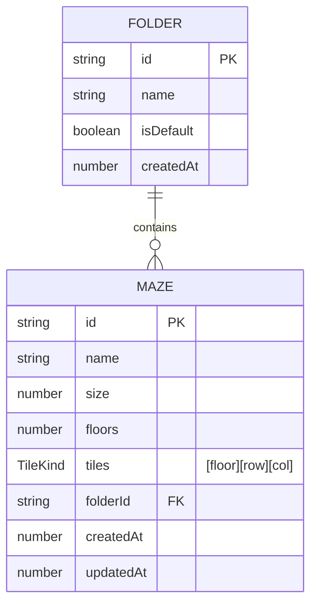

# DB 設計

ProgPath（再開発版）の**ローカル永続化データの設計**を定義する。データモデル・スキーマ（Zod）・コレクション設計（TanStack DB）・IndexedDB 永続化・初期データ/復旧・QR シリアライズを扱う。

- 対象読者: 新規開発者、および設計判断の参照者（人・AI）。
- 前提: 永続化対象は **迷路（maze）・フォルダ（folder）のみ**（→ [architecture.md](./architecture.md) 5.3）。コマンドスタック・実行時状態・UI 状態は永続化しない。
- ドメインルールは [features.md](./features.md)、配置（`shared/db`）は [directory-structure.md](./directory-structure.md) を正とする。
- アクセスは TanStack DB（Provider 不要・コレクションはシングルトン）、ローカル DB は IndexedDB、検証は Zod（→ [CLAUDE.md](../CLAUDE.md)）。

> 〔要確認〕が付いた箇所は暫定。実装・検証で確定させる。スキーマ例の型は設計意図を示すもので、実装時に調整しうる。

---

## 1. 永続化スコープ

| 区分 | 対象 | 保存先 |
| --- | --- | --- |
| **永続化する** | 迷路（maze）/ フォルダ（folder） | IndexedDB |
| 永続化しない（揮発） | コマンドスタック・ロボット実行時状態・選択/展開状態・カメラ映像 | メモリ（Zustand / XState） |

永続化対象は 2 エンティティのみ。手動並び替えは v1 で行わないため、並び順を保持する項目は持たない（既定順＝作成日時）。

---

## 2. データモデル

フォルダ 1 — N 迷路。迷路は必ず 1 つのフォルダに属する（既定は「未分類」）。



- 「未分類」フォルダは予約 ID で常に 1 つ存在し、削除・リネーム不可（`isDefault: true`）。
- フォルダを削除すると、内包する迷路は**未分類へ移動**する（`folderId` を未分類に張り替え。迷路自体は消さない）〔要確認: features.md 3.4 と連動〕。

---

## 3. エンティティ定義

> **日時は `number`（epoch ms）で持つ**。`Date` 型は IndexedDB（structured clone）には保存できるが、JSON 境界（QR・将来の連携）を跨ぐと文字列化して型が壊れる。number はシリアライズに強く、作成順ソートも数値比較で自明なため既定とする。日時の用途は並び順と更新追跡のみで、児童への日時表示は行わない。

### 3.1 folder

| フィールド | 型 | 説明 |
| --- | --- | --- |
| `id` | string | 一意 ID。未分類は予約 ID（定数） |
| `name` | string | フォルダ名（未分類は固定名） |
| `isDefault` | boolean | 未分類フラグ。`true` は削除・リネーム不可 |
| `createdAt` | number | 作成時刻（epoch ms）。既定の並び順に使用 |

### 3.2 maze

| フィールド | 型 | 説明 |
| --- | --- | --- |
| `id` | string | 一意 ID |
| `name` | string | 迷路名 |
| `size` | number | 一辺のマス数（5〜7）。**全階共通** |
| `floors` | number | 階層数（1〜3） |
| `tiles` | TileKind[][][] | タイル配置 `[floor][row][col]`（密配列） |
| `folderId` | string | 所属フォルダ ID（既定は未分類） |
| `createdAt` | number | 作成時刻（epoch ms） |
| `updatedAt` | number | 更新時刻（epoch ms） |

### 3.3 タイル種別（TileKind）

単一の文字列リテラルユニオンで表す。テレポートは上下を別種別とし、構造を単純に保つ。

| 値 | 意味 |
| --- | --- |
| `floor` | 床 |
| `wall` | 壁 |
| `hole` | 穴 |
| `start` | スタート（迷路に 1 つ） |
| `goal` | ゴール（迷路に 1 つ） |
| `teleportUp` | テレポート（上へ） |
| `teleportDown` | テレポート（下へ） |
| `key` | カギ |

### 3.4 座標とタイル配置

- `tiles[floor][row][col]` でアクセスする。`floor` は 0 始まり（表示階 = `floor + 1`）。
- 全階共通サイズのため、各階は `size × size` の正方グリッド。
- 実行エンジンはロボット位置 `(floor, row, col)` から O(1) でタイル種別を引く。
- テレポートの整合判定（同位置の上下階タイル）は全階共通サイズにより同一 `(row, col)` で対応づく。

---

## 4. スキーマ（Zod）

永続データ・QR・入力は Zod で検証する。型と検証規則の設計意図を示す（実装時に調整可）。

```typescript
import { z } from "zod";

export const TileKindSchema = z.enum([
  "floor", "wall", "hole", "start", "goal",
  "teleportUp", "teleportDown", "key",
]);

const MIN_SIZE = 5;
const MAX_SIZE = 7;
const MIN_FLOORS = 1;
const MAX_FLOORS = 3;

export const MazeSchema = z
  .object({
    id: z.string(),
    name: z.string().min(1),
    size: z.number().int().min(MIN_SIZE).max(MAX_SIZE),
    floors: z.number().int().min(MIN_FLOORS).max(MAX_FLOORS),
    tiles: z.array(z.array(z.array(TileKindSchema))),
    folderId: z.string(),
    createdAt: z.number().int(),
    updatedAt: z.number().int(),
  })
  // 寸法整合: floors 層・各層 size×size
  .refine((m) => m.tiles.length === m.floors, "階層数が tiles と不一致")
  .refine(
    (m) => m.tiles.every((f) => f.length === m.size && f.every((r) => r.length === m.size)),
    "各階の寸法が size と不一致",
  )
  // スタート/ゴールは各 1 つ
  .refine((m) => countKind(m, "start") === 1, "スタートは 1 つ")
  .refine((m) => countKind(m, "goal") === 1, "ゴールは 1 つ");

export const FolderSchema = z.object({
  id: z.string(),
  name: z.string().min(1),
  isDefault: z.boolean(),
  createdAt: z.number().int(),
});

export type TileKind = z.infer<typeof TileKindSchema>;
export type Maze = z.infer<typeof MazeSchema>;
export type Folder = z.infer<typeof FolderSchema>;
```

- **テレポート整合**（移動先が存在しない/壁・穴・テレポート）は編集時の検証（→ [features.md](./features.md) 4.6）。永続スキーマでは寸法・スタート/ゴール個数の構造検証を行う〔要確認: テレポート整合をスキーマ側でも検証するか〕。
- 文字数上限（name）は features.md 3.6 の〔要確認〕に従い、確定後に `max` を付す。

---

## 5. コレクション設計（TanStack DB）

`shared/db` にコレクションを**モジュールレベルのシングルトン**として定義する。Provider は不要で、UI は `useLiveQuery` で直接購読する（→ [directory-structure.md](./directory-structure.md) 4.1）。

```typescript
// shared/db/collections.ts（設計イメージ）
export const folderCollection = createCollection(
  /* IndexedDB バック・options */ {
    id: "folders",
    getKey: (f: Folder) => f.id,
    schema: FolderSchema,
  },
);

export const mazeCollection = createCollection(
  {
    id: "mazes",
    getKey: (m: Maze) => m.id,
    schema: MazeSchema,
  },
);
```

- `getKey` は各エンティティの `id`。
- 読み出しは `useLiveQuery((q) => q.from({ maze: mazeCollection }))` の形。フォルダで絞る場合は `folderId` で where。
- 変更は `collection.insert / update / delete` で行い、UI はライブクエリで自動更新。

---

## 6. IndexedDB 永続化

TanStack DB の組み込みアダプタには localStorage はあるが IndexedDB は無いため、**IndexedDB バックの永続化層を介してコレクションへ接続**する〔要確認: 接続方式・利用ライブラリ（例 `idb`）〕。

### オブジェクトストア

| ストア | keyPath | インデックス |
| --- | --- | --- |
| `folders` | `id` | — |
| `mazes` | `id` | `folderId`（フォルダ別取得用） |

- 1 DB・2 ストア構成。サイズが小さい（1 迷路最大 147 セル）ため軽量。
- DB スキーマには**バージョン番号**を持たせ、将来のマイグレーションに備える〔要確認: 初期バージョン〕。

---

## 7. 初期データと復旧

- **未分類フォルダの保証**: 起動時に未分類フォルダ（予約 ID）の存在を確認し、無ければ作成する。
- **迷路の空状態は正常**: 迷路が 0 件は有効な状態で、ホームは案内 UI を表示する（→ [features.md](./features.md) 3.3）。サンプル迷路の自動投入は**しない**。
- **不正データの復旧**: Zod 検証に通らないレコードは破棄・初期状態へ復旧する（→ [requirements.md](./requirements.md) 5.5）。未分類フォルダのような必須データは再生成する。

> 旧実装は「空配列なら初期迷路を投入」だったが、to-be では空は正常（案内 UI）とし、**不正時のみ復旧**に引き直す。

---

## 8. QR シリアライズ

迷路を **1 迷路 = 1 QR** で共有する（→ [features.md](./features.md) 3.5）。

### エンコード（エクスポート）

```
maze（共有用ペイロード） → JSON → 圧縮（deflate / fflate）→ base45（RFC 9285）→ QR（英数モード）
```

- ペイロードに含める: `schemaVersion` / `name` / `size` / `floors` / `tiles`。
- ペイロードに含めない: `id`（インポート時に再採番）/ `folderId`（インポート先で決定）/ `createdAt` / `updatedAt`。
- **収容（#177 で実測確定）**: 仕様内の迷路（5×5〜7×7・1〜3 階＝最大 147 セル）は単一 QR に**余裕を持って収まる**。最悪ケース（全セルを一様ランダム＝最大エントロピー、名前 50 字）でも採用構成（`fflate` deflate + base45 + ECC Q）で **QR v19 相当**、絶対上限 v40 に対し大きな余裕がある。**分割は不要**。
- **圧縮ライブラリ**: `fflate`（deflate）を採用。`pako` と出力サイズはほぼ同一だがバンドルが小さく（≈8KB）依存ゼロ・tree-shake 可能。`lz-string` は最も非効率で不採用。
- **テキスト符号化**: `base45`（RFC 9285, QR 英数モード）を採用。同じ圧縮バイトでも Base64（バイトモード）より 2〜3 版低い QR に収まり、低バージョン＝低密度で安価カメラ・低スペック端末でも読みやすい。読取（`qr-scanner`=jsQR）で英数モードのラウンドトリップを確認済み。
- **QR 誤り訂正レベル**: `Q`（25%復元）を採用。迷路 QR は画面表示 → カメラ読取のため、グレア・反射による部分欠損への耐性を厚くする。base45 で最悪 v19（93²）と密度は許容範囲。M（15%）でも収容は可能だが、教室の安価カメラ前提では Q の堅牢性を優先。H は密度が上がるだけで不要。
- **サイズ上限・超過時**: ハード上限は QR v40。仕様内の迷路は構造上これを超えないため、圧縮後が QR 容量を超える場合のエラー表示（→ [features.md](./features.md) 3.5）は `schemaVersion` 変更等に備える防御的セーフティネットであり、正常運用では発火しない。
- **QR 生成ライブラリ**: `qrcode-generator`（軽量 UMD・依存ゼロ）を採用。QR 英数モードの指定・ECC 指定・生成バージョン取得を #177 で確認済み。React では canvas / SVG API で描画する。読取側は既定どおり `qr-scanner`（jsQR）。

### デコード（インポート）

1. QR 文字列 → base45 デコード → 解凍（inflate）→ JSON パース。
2. Zod（共有用スキーマ）で検証。`schemaVersion` を確認。
3. `id` を新規採番、`folderId` を**未分類**に設定、`createdAt`/`updatedAt` を現在時刻で付与して保存。

> `schemaVersion` を持たせ、QR 形式・スキーマ変更時の前方/後方互換を判定できるようにする。

> 収容の実測根拠は [spikes/177-qr-capacity](../spikes/177-qr-capacity/README.md)（#177）。圧縮ライブラリ・符号化・誤り訂正レベルの比較計測に基づく。

---

## 9. 関連ドキュメント

- [requirements.md](./requirements.md) — 要件定義（永続化要件 5.5）
- [features.md](./features.md) — 機能仕様（迷路・フォルダ・QR の振る舞い）
- [architecture.md](./architecture.md) — アーキテクチャ設計（永続化スコープ 5.3）
- [directory-structure.md](./directory-structure.md) — ディレクトリ構成（shared/db）
- [glossary.md](./glossary.md) — 用語集
- [CLAUDE.md](../CLAUDE.md) — リポジトリ運用指針
