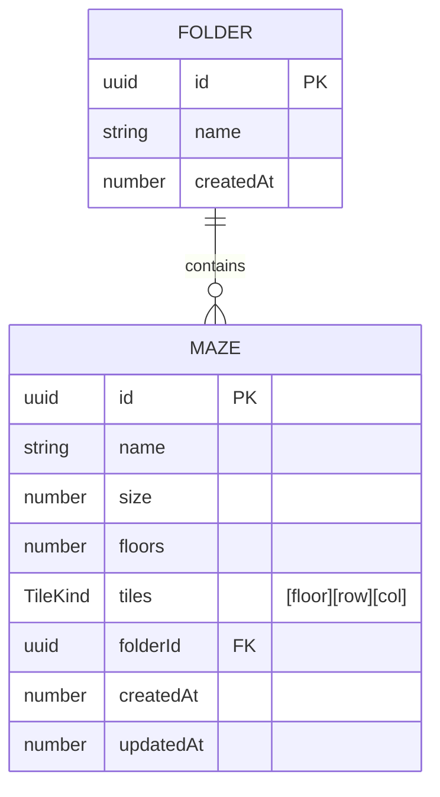

# DB 設計

ProgPath（再開発版）の**ローカル永続化データの設計**を定義する。データモデル・スキーマ（Zod）・コレクション設計（TanStack DB）・SQLite 永続化・初期データ/復旧・QR シリアライズを扱う。

- 対象読者: 新規開発者、および設計判断の参照者（人・AI）。
- 前提: 永続化対象は **迷路（maze）・フォルダ（folder）のみ**（→ [architecture.md](./architecture.md) 5.3）。コマンドスタック・実行時状態・UI 状態は永続化しない。
- ドメインルールは [features.md](./features.md)、配置（`shared/db`）は [directory-structure.md](./directory-structure.md) を正とする。
- アクセスは TanStack DB（Provider 不要・コレクションはシングルトン）、ローカル DB は **SQLite（ブラウザは WASM + OPFS）**、検証は Zod（→ [CLAUDE.md](../CLAUDE.md)）。永続化は TanStack DB の `persistedCollectionOptions`（`@tanstack/browser-db-sqlite-persistence`）で担う。

> 〔要確認〕が付いた箇所は暫定。実装・検証で確定させる。スキーマ例の型は設計意図を示すもので、実装時に調整しうる。

---

## 1. 永続化スコープ

| 区分 | 対象 | 保存先 |
| --- | --- | --- |
| **永続化する** | 迷路（maze）/ フォルダ（folder） | SQLite（WASM + OPFS） |
| 永続化しない（揮発） | コマンドスタック・ロボット実行時状態・選択/展開状態・カメラ映像 | メモリ（Zustand / XState） |

永続化対象は 2 エンティティのみ。手動並び替えは v1 で行わないため、並び順を保持する項目は持たない（既定順＝作成日時）。

---

## 2. データモデル

フォルダ 1 — N 迷路。迷路は必ず 1 つのフォルダに属する（既定は「未分類」）。



- 予約フォルダは 2 つ（「未分類」= nil UUID / 「チュートリアル」= 固定 v4 UUID）。どちらも起動時に存在保証する（→ 7）。
- **予約フォルダを表す永続フィールドは持たない。** 種別は予約 ID との一致だけから導く（判別ロジックは `entities/folder` の `getFolderKind`）。フラグを併置すると ID と食い違う余地が生まれ、`maze.folderId` しか持たない呼び出し側が判定できなくなるため（旧 `isDefault` は #192 で廃止）。
- 種別ごとの可否（削除・リネーム・出入り）は 1 枚の表で持つ（→ [features.md](./features.md) 3.4 の権限マトリクス）。
- **フォルダを削除すると、内包する迷路も一緒に削除される**（全フォルダ共通。未分類への退避は行わない）。

---

## 3. エンティティ定義

> **日時は `number`（epoch ms）で持つ**。`Date` 型は JSON 境界（QR・将来の連携）や SQLite の列表現を跨ぐと文字列化して型が壊れやすい。number はシリアライズに強く、作成順ソートも数値比較で自明なため既定とする。日時の用途は並び順と更新追跡のみで、児童への日時表示は行わない。

### 3.1 folder

| フィールド | 型 | 説明 |
| --- | --- | --- |
| `id` | uuid | 一意 ID（UUID v4 / `crypto.randomUUID`）。未分類は予約 nil UUID（`UNCATEGORIZED_FOLDER_ID`）、チュートリアルは予約 v4 UUID（`TUTORIAL_FOLDER_ID`）。いずれも `shared/config` |
| `name` | string | フォルダ名（予約フォルダは固定名でリネーム不可） |
| `createdAt` | number | 作成時刻（epoch ms）。既定の並び順に使用。予約フォルダは常に先頭へ来るよう未分類 = `0` / チュートリアル = `1` を固定値で持つ |

> **フォルダ種別の列は無い。** 「これは未分類か」は `id === UNCATEGORIZED_FOLDER_ID` で判る。旧 `isDefault` は二重管理でしかなく（チュートリアルは予約フォルダなのに `isDefault: false` だった）、#192 で廃止した。

### 3.2 maze

| フィールド | 型 | 説明 |
| --- | --- | --- |
| `id` | uuid | 一意 ID（UUID v4 / `crypto.randomUUID`） |
| `name` | string | 迷路名 |
| `size` | number | 一辺のマス数（5〜7）。**全階共通** |
| `floors` | number | 階層数（1〜3） |
| `tiles` | TileKind[][][] | タイル配置 `[floor][row][col]`（密配列） |
| `folderId` | uuid | 所属フォルダ ID（既定は未分類 = `UNCATEGORIZED_FOLDER_ID`） |
| `createdAt` | number | 作成時刻（epoch ms） |
| `updatedAt` | number | 更新時刻（epoch ms） |

### 3.3 タイル種別（TileKind）

単一の文字列リテラルユニオンで表す。テレポートは上下を別種別とし、構造を単純に保つ。

| 値 | 意味 |
| --- | --- |
| `floor` | 床 |
| `wall` | 壁 |
| `hole` | 穴 |
| `start` | スタート（迷路に 1 つ） |
| `goal` | ゴール（迷路に 1 つ） |
| `teleportUp` | テレポート（上へ） |
| `teleportDown` | テレポート（下へ） |
| `key` | カギ |

### 3.4 座標とタイル配置

- `tiles[floor][row][col]` でアクセスする。`floor` は 0 始まり（表示階 = `floor + 1`）。
- 全階共通サイズのため、各階は `size × size` の正方グリッド。
- 実行エンジンはロボット位置 `(floor, row, col)` から O(1) でタイル種別を引く。
- テレポートの整合判定（同位置の上下階タイル）は全階共通サイズにより同一 `(row, col)` で対応づく。

---

## 4. スキーマ（Zod）

永続データ・QR・入力は Zod で検証する。型と検証規則の設計意図を示す（実装時に調整可）。

```typescript
import { z } from "zod";

export const TileKindSchema = z.enum([
  "floor", "wall", "hole", "start", "goal",
  "teleportUp", "teleportDown", "key",
]);

const MIN_SIZE = 5;
const MAX_SIZE = 7;
const MIN_FLOORS = 1;
const MAX_FLOORS = 3;

// 構造検証のみ（寸法・start/goal）。起動時の破壊的な復旧掃引（→ 7）はこの構造スキーマで判定する
export const MazeSchema = z
  .object({
    id: z.string().uuid(),
    name: z.string().min(1),
    size: z.number().int().min(MIN_SIZE).max(MAX_SIZE),
    floors: z.number().int().min(MIN_FLOORS).max(MAX_FLOORS),
    tiles: z.array(z.array(z.array(TileKindSchema))),
    folderId: z.string().uuid(),
    createdAt: z.number().int(),
    updatedAt: z.number().int(),
  })
  // 寸法整合: floors 層・各層 size×size
  .refine((m) => m.tiles.length === m.floors, "階層数が tiles と不一致")
  .refine(
    (m) => m.tiles.every((f) => f.length === m.size && f.every((r) => r.length === m.size)),
    "各階の寸法が size と不一致",
  )
  // スタート/ゴールは各 1 つ
  .refine((m) => countKind(m, "start") === 1, "スタートは 1 つ")
  .refine((m) => countKind(m, "goal") === 1, "ゴールは 1 つ");

// 構造 + テレポート整合。実行開始時の入力検証・将来の編集 UI(#195) の保存前検証で使う。
// 破壊的な復旧掃引（→ 7）には使わず、テレポート不整合だけで迷路レコードを削除しない。
// superRefine は推論型を変えないため、PlayableMazeSchema も同じ Maze 型を推論する。
export const PlayableMazeSchema = MazeSchema.superRefine((maze, ctx) => {
  for (const issue of validateTeleportLinks(maze)) {
    ctx.addIssue({ code: "custom", path: [/* source 座標 */], message: /* 迷路外 / 移動先が壁・穴・テレポート */ });
  }
});

export const FolderSchema = z.object({
  id: uuidField, // 「v4 または予約 nil」。下の ID の項を参照
  name: z.string().min(1),
  createdAt: z.number().int(),
});

export type TileKind = z.infer<typeof TileKindSchema>;
export type Maze = z.infer<typeof MazeSchema>;
export type Folder = z.infer<typeof FolderSchema>;
```

- **ID は UUID v4**。作成時に `crypto.randomUUID()` で採番する（論理型は上表の `uuid`／推論される TS 型は `string`。ブランド型は導入しない）。未分類フォルダは予約 nil UUID（`shared/config` の `UNCATEGORIZED_FOLDER_ID`）。**採用した Zod v4 の `z.uuid()` は版数を検査し nil（全 0）を弾く**ため、ID フィールドは `z.union([z.uuid(), z.literal(UNCATEGORIZED_FOLDER_ID)])`（= 「v4 または予約 nil」）で定義して nil を確実に通す（実装: `shared/db/model/schema.ts` の `uuidField`。#179 で確定）。
- **テレポート整合**（移動先が存在しない/壁・穴・テレポート）は `shared/db/lib/validate-teleport-links.ts` の純粋関数 `validateTeleportLinks` で検証し、**構造のみの `MazeSchema` とは分けた `PlayableMazeSchema`（= `MazeSchema` + テレポート整合）** に載せる。`PlayableMazeSchema` は実行開始時の入力検証と将来の編集 UI（#195）の保存前検証で同じルールを共有する。**起動時の破壊的な復旧掃引（→ 7）には使わない**ため、テレポート不整合だけで迷路レコードが削除されることはない。反対向きのテレポートは必須にしない（→ [features.md](./features.md) 4.6）。
- 文字数上限（name）は features.md 3.6 の〔要確認〕に従い、確定後に `max` を付す。

---

## 5. コレクション設計（TanStack DB）

`shared/db` にコレクションを**モジュールレベルのシングルトン**として定義する。Provider は不要で、UI は `useLiveQuery` で直接購読する（→ [directory-structure.md](./directory-structure.md) 4.1）。

SQLite（OPFS）を開くのは非同期のため、コレクションは `initDb()`（`shared/db`）で一度だけ生成し、以後はシングルトンとして共有する。アプリ起動時に `initDb()` を呼び、初期データ保証・不正データ復旧（→ 7）を済ませてから UI をレンダリングする。

```typescript
// shared/db/model/collections.ts（設計イメージ）
// persistence は openBrowserWASQLiteOPFSDatabase → createBrowserWASQLitePersistence で生成し、
// 2 コレクションで共有する。
const folderCollection = createCollection(
  persistedCollectionOptions<Folder, string>({
    id: "folders",
    getKey: (f) => f.id,
    persistence,
    schemaVersion: SCHEMA_VERSION,
  }),
);
```

- `getKey` は各エンティティの `id`。
- 読み出しは `useLiveQuery((q) => q.from({ maze: mazeCollection }))` の形。フォルダで絞る場合は `folderId` で where。
- 変更は `collection.insert / update / delete` で行い、UI はライブクエリで自動更新。
- **Zod 検証の適用点**: `persistedCollectionOptions` はコレクションの `schema` フックに Zod を取らない（行の型を `<T, TKey>` で与える設計）。よって Zod 検証は **(a) 起動時の復旧掃引（→ 7）＝構造のみの `MazeSchema`** と **(b) 書き込み境界・実行開始時＝テレポート整合まで見る `PlayableMazeSchema`（`entities` / `features` で `insert` 前に parse）** で明示的に行う。(a) を構造のみに限ることで、テレポート不整合だけで永続レコードを削除しない。スキーマの正は `shared/db/model/schema.ts` に置き、上位スライスが再利用する。

---

## 6. SQLite 永続化

TanStack DB の組み込みアダプタには localStorage はあるが IndexedDB は無い。IndexedDB を直結する公式経路も無い（TanStack は索引・接続管理の都合で組み込み IndexedDB アダプタを提供しない）。そこで **TanStack DB 公式の永続化 `persistedCollectionOptions`（SQLite バック）を採用**する（#179 で確定）。

### 接続方式（確定）

- ブラウザ／WebView: `@tanstack/browser-db-sqlite-persistence` の `openBrowserWASQLiteOPFSDatabase`（wa-sqlite + OPFS）で DB を開き、`createBrowserWASQLitePersistence` で persistence を生成、2 コレクションで共有する。
- DB 名は `prog-path`（`shared/db` の `DB_NAME`）。
- **採用理由**: Zod を単一スキーマに保てる（RxDB は RxJsonSchema と Zod の二重定義が必須）／TanStack 第一者統合で保守が容易／folder 1—N maze の関係データに自然／Tauri 配布のため WASM バンドル増は実質無害。RxDB・localStorage・自作 idb アダプタは却下（→ 経緯は #179）。

### スキーマバージョン

- `persistedCollectionOptions` の `schemaVersion`（`shared/db` の `SCHEMA_VERSION`）で管理する。**現在値は `1`**（#179 の初版のまま）。
- **`createPersistence` は `schemaMismatchPolicy: "reset"` を明示する。この 1 行を外してはならない**（#192）。
  - 本アプリは sync を渡さない**ローカル専用**構成なので、省略すると `resolveSchemaMismatchPolicy(undefined, "sync-absent")` が **`sync-absent-error`** を返す（`sync-present-reset` ではない）。
  - その既定では、保存済みバージョンと食い違ったときアダプタは**テーブルを削除せず** `InvalidPersistedCollectionConfigError` を throw する。さらにその例外を loopback sync が `console.warn` だけして ready 扱いにするため、**エラー画面も出ないまま全件 0 件に見え、以後の書き込みが静かに全て失敗し続ける**。データは消えていないのに到達できず、リロードしても直らず、アプリ内に復旧手段が無い。
  - `reset` を明示すると本来期待どおり「ローカルを消して作り直す」になり、次回起動以降は正常に動く（#192 のレビューで両方を実機再現して確認）。
- **上げるとローカルの迷路・フォルダは全て破棄される。** folders / mazes が同じ定数を共有しているのでどちらも消える。起動時の存在保証で未分類・チュートリアルは復帰するが、**ユーザーが作った迷路は戻らない**。判定は単純な不一致（`!==`）なので、**バージョンを戻したとき（リリース差し戻し）も同様に破棄される**。
- **フィールドの削除では上げなくてよい。** Zod の `z.object` は未知キーを黙って剥がすため、保存済み行に残った旧フィールドはそのままスキーマ検証を通り、起動時の掃引でも消えない。`Folder.isDefault` の廃止（#192）はこれに該当するため据え置いた（前提は `schema.test.ts` / `bootstrap.test.ts` が固定）。
- データは小さい（1 迷路最大 147 セル）ため軽量。

### 検証状況（スパイク）

- **ブラウザ（Chromium）: 検証済み ✅**。実コード（`initDb()`）で OPFS DB オープン・未分類フォルダ自動生成・迷路の insert/delete がページ再読込を跨いで永続することを確認（→ [spikes/179-sqlite-opfs](../spikes/179-sqlite-opfs/README.md)）。`OPFSCoopSyncVFS` は専用 Worker で動き COOP/COEP は不要。
- **Tauri WebView: 未検証**。macOS(WKWebView)・Linux(WebKitGTK) の OPFS 対応は WebView 依存のため、実機（`mise run dev:desktop`）で確認する（#175 と併せて）。不成立時は Tauri ネイティブ SQLite アダプタ、最終的に RxDB/IndexedDB へフォールバックする。

---

## 7. 初期データと復旧

- **未分類フォルダの保証**: 起動時に未分類フォルダ（予約 ID = `UNCATEGORIZED_FOLDER_ID` / nil UUID）の存在を確認し、無ければ作成する。
- **チュートリアルの存在保証**: 授業導入用の教材迷路を専用「チュートリアル」フォルダ（予約固定 ID）にまとめ、起動時（不正データの掃引・未分類フォルダ保証の後）に**予約 ID で常に保証**する — フォルダ・各迷路とも無ければ作り、欠損 ID だけ補う（既存は上書きしない）。**フォルダも中の迷路も削除できるが、次の保証で戻る**（可否は → [features.md](./features.md) 3.4 の権限マトリクス）。迷路は 6 件・易→難のカリキュラム順（内容は今後拡充。→ [features.md](./features.md) 3.3）。
- **不正データの復旧**: **構造検証（`MazeSchema`）に通らない**レコードのみ破棄・初期状態へ復旧する（→ [requirements.md](./requirements.md) 5.5）。テレポート不整合のような**実行開始時に検出・拒否できる問題では削除せず**、保存済みデータを保護する（実行前は `PlayableMazeSchema`、編集 UI は保存前検証で扱う）。未分類フォルダのような必須データは再生成する。
- **再生成の入口は 2 つ、挙動は 1 つ**: 起動時と、UI の再生成ボタン（→ [features.md](./features.md) 3.6）。どちらも同じ `ensureInitialData()` を呼ぶだけで**完全に冪等**。行うのは「上の不正データ掃引」＋「足りない予約データの補充」の 2 つで、**構造検証を通る正常なレコードは 1 件も消さない**（ボタンから呼んでも起動時と同じ＝ボタンで新たに失うものは無い）。全消去する「初期化」処理は用意しない。
- **迷路の存在判定は ID の有無だけで行う**（`folderId` は見ない）。そのため教材迷路が別フォルダに散らばると「ある」と判定され回収されない。フォルダ削除で中身も消し、チュートリアルの出入りを禁じているのは、この状態を発生させないため（→ [features.md](./features.md) 3.4）。

> `shared/db` の `resetDb()` は名前が似ているが別物で、起動失敗時のリトライ用に **`initDb()` のキャッシュ Promise を捨てるだけ**。データには一切触れない。再生成の用途に使わないこと。

> 旧実装の「空配列なら初期迷路を投入」とは異なり、to-be では**授業導入用のチュートリアル（教材）を予約 ID で保証**する（未分類フォルダと同格の存在保証）。ユーザー作成の迷路が無いときに案内 UI を出すのはユーザー領域の話。ただし**「常に存在する」わけではない**: 保証されるのは起動時と再生成ボタン押下時で、セッション中はフォルダごと削除できるため一時的に消えている状態がありうる（空状態の設計は → [screen-specs.md](./screen-specs.md) 4.4）。不正データの扱いは構造検証による破棄・復旧に限定する（上記）。

---

## 8. QR シリアライズ

迷路を **1 迷路 = 1 QR** で共有する（→ [features.md](./features.md) 3.5）。

### エンコード（エクスポート）

```
maze（共有用ペイロード） → JSON → 圧縮（deflate / fflate）→ base45（RFC 9285）→ QR（英数モード）
```

- ペイロードに含める: `schemaVersion` / `name` / `size` / `floors` / `tiles`。
- ペイロードに含めない: `id`（インポート時に UUID v4 で再採番）/ `folderId`（インポート先で決定）/ `createdAt` / `updatedAt`。
- **収容（#177 で実測確定）**: 仕様内の迷路（5×5〜7×7・1〜3 階＝最大 147 セル）は単一 QR に**余裕を持って収まる**。最悪ケース（全セルを一様ランダム＝最大エントロピー、名前 50 字）でも採用構成（`fflate` deflate + base45 + ECC Q）で **QR v19 相当**、絶対上限 v40 に対し大きな余裕がある。**分割は不要**。
- **圧縮ライブラリ**: `fflate`（deflate）を採用。`pako` と出力サイズはほぼ同一だがバンドルが小さく（≈8KB）依存ゼロ・tree-shake 可能。`lz-string` は最も非効率で不採用。
- **テキスト符号化**: `base45`（RFC 9285, QR 英数モード）を採用。同じ圧縮バイトでも Base64（バイトモード）より 2〜3 版低い QR に収まり、低バージョン＝低密度で安価カメラ・低スペック端末でも読みやすい。読取（`qr-scanner`=jsQR）で英数モードのラウンドトリップを確認済み。
- **QR 誤り訂正レベル**: `Q`（25%復元）を採用。迷路 QR は画面表示 → カメラ読取のため、グレア・反射による部分欠損への耐性を厚くする。base45 で最悪 v19（93²）と密度は許容範囲。M（15%）でも収容は可能だが、教室の安価カメラ前提では Q の堅牢性を優先。H は密度が上がるだけで不要。
- **サイズ上限・超過時**: ハード上限は QR v40。仕様内の迷路は構造上これを超えないため、圧縮後が QR 容量を超える場合のエラー表示（→ [features.md](./features.md) 3.5）は `schemaVersion` 変更等に備える防御的セーフティネットであり、正常運用では発火しない。
- **QR 生成ライブラリ**: `qrcode-generator`（軽量 UMD・依存ゼロ）を採用。QR 英数モードの指定・ECC 指定・生成バージョン取得を #177 で確認済み。React では canvas / SVG API で描画する。読取側は既定どおり `qr-scanner`（jsQR）。

### デコード（インポート）

1. QR 文字列 → base45 デコード → 解凍（inflate）→ JSON パース。
2. Zod（共有用スキーマ）で検証。`schemaVersion` を確認。
3. `id` を UUID v4 で新規採番、`folderId` を**未分類**（`UNCATEGORIZED_FOLDER_ID`）に設定、`createdAt`/`updatedAt` を現在時刻で付与して保存。

> `schemaVersion` を持たせ、QR 形式・スキーマ変更時の前方/後方互換を判定できるようにする。

> 収容の実測根拠は [spikes/177-qr-capacity](../spikes/177-qr-capacity/README.md)（#177）。圧縮ライブラリ・符号化・誤り訂正レベルの比較計測に基づく。

---

## 9. 関連ドキュメント

- [requirements.md](./requirements.md) — 要件定義（永続化要件 5.5）
- [features.md](./features.md) — 機能仕様（迷路・フォルダ・QR の振る舞い）
- [architecture.md](./architecture.md) — アーキテクチャ設計（永続化スコープ 5.3）
- [directory-structure.md](./directory-structure.md) — ディレクトリ構成（shared/db）
- [glossary.md](./glossary.md) — 用語集
- [CLAUDE.md](../CLAUDE.md) — リポジトリ運用指針
