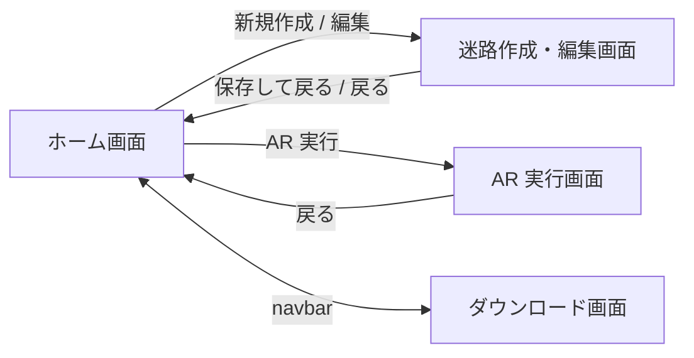
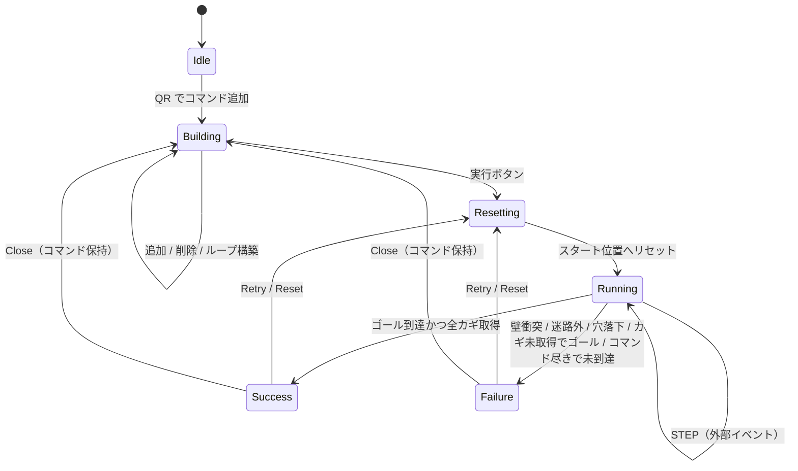

# 機能仕様

ProgPath（再開発版）の**画面別の機能・振る舞い**を定義する。各画面の「目的 / 構成要素 / 主要な振る舞い / 状態遷移 / エッジケース」を記述し、実装・設計判断の拠り所とする。

- 対象読者: 新規開発者、および設計判断の参照者（人・AI）。
- 記述の方針: **振る舞い中心**。FSD のスライス名・コンポーネント名には最小限しか踏み込まず、詳細は [directory-structure.md](./directory-structure.md) に委ねる。
- 上位の「何を作るか」は [requirements.md](./requirements.md) を正とする。本書はその画面・振る舞いへの落とし込み。
- 用語は [glossary.md](./glossary.md) に統一定義する（整備中）。

> 〔要確認〕が付いた値・挙動は暫定。実機検証・運用で確定させる。
> 数値・技術前提は to-be（**階層 1〜3 / サイズ 5×5〜7×7 / SQLite(WASM+OPFS) + TanStack DB / Tauri**）を正とする。

---

## 1. 全体像

### 1.1 画面一覧

| 画面 | 役割 | 位置づけ |
| --- | --- | --- |
| ホーム画面 | 迷路の管理（CRUD・フォルダ・QR 共有） | 入口 |
| 迷路作成・編集画面 | グリッドで迷路を構築・編集 | 補助価値（迷路エディタ） |
| AR 実行画面 | QR カードで命令作成し、AR で実行 | **★中心価値** |
| ダウンロード画面 | デスクトップ版の入手導線 | 配布導線 |

### 1.2 画面遷移

- どの画面からも navbar 経由でホーム／ダウンロードへ遷移できる。
- AR 実行画面・迷路編集画面へは、ホームで対象の迷路を選択している状態から遷移する。

### 1.3 確定したドメインルール（要約）

本書全体で前提とする中核ルール。詳細は各章に記す。

| 項目 | ルール |
| --- | --- |
| 迷路サイズ | 1〜3 階、各階 5×5〜7×7 |
| タイル種別 | 床 / 壁 / 穴 / スタート / ゴール / テレポート（上・下）/ カギ |
| スタート・ゴール | 迷路に各 1 つ必須 |
| ロボット初期向き | **南向きで固定**（迷路ごとに指定しない） |
| コマンド種別 | forward / turnRight / turnLeft / ifHole / loop（loopStart・loopEnd の対） |
| loop | **loopStart で開始・loopEnd で完了**の対。**多重ネスト可**。繰り返し回数 **2〜10**〔要確認〕 |
| ifHole | 前方に穴があれば埋める。**穴が無ければ何もしない（no-op）** |
| カギ | 踏むと**自動取得**（順不同）。全カギ取得がゴール条件 |
| テレポート | 上下階の同位置へ移動。**向きは維持** |
| 失敗条件 | 壁衝突 / 迷路外 / 穴落下 / カギ未取得でゴール到達 / コマンド尽きで未到達 |
| QR 共有 | **1 迷路 = 1 QR** を前提（収まらなければエラー） |

---

## 2. 共通要素

### 2.1 navbar（全画面共通）

- ホーム画面へ遷移するアイコンボタン。
- アプリ名（ProgPath）と現在のページ名を表示する。
- ダウンロード画面へ遷移するアイコンボタン。

### 2.2 共通の表示方針

- 用語・アイコン・配色は全画面で一貫させる（→ [glossary.md](./glossary.md)）。
- 小学生（高学年）が迷わない情報量を保つ。操作前の説明・モーダルは最小限にする。
- ダイアログは画面中央にオーバーレイ表示する。確認系（削除など）は誤操作防止のため明示の確定操作を要求する。

### 2.3 エラー・失敗の表現

- **操作エラー**（編集時のタイル整合エラーなど）: 原因に応じたメッセージをダイアログで提示する。
- **実行失敗**（AR 実行でゴール不可）: 失敗ダイアログを揺れアニメーション付きで提示し、原因を伝える。
- 不正データは破棄して復旧する。チュートリアル迷路（専用フォルダ）は起動時に予約 ID で常に存在保証する（削除不可・UI で制限。→ [requirements.md](./requirements.md) 5.5 / [db-design.md](./db-design.md) 7）。

---

## 3. ホーム画面 — 迷路管理

### 3.1 目的

保存済みの迷路を一覧・整理し、作成・編集・削除・AR 実行・QR 共有の起点になる。

### 3.2 構成要素

- **フォルダ一覧**: 迷路を分類するフォルダの一覧。各フォルダは折りたたみ／展開できる。
- **迷路一覧**: 選択中フォルダ内の迷路カード。各カードは迷路名・サイズ・プレビュー（スタートのある階の俯瞰 2D）を表示する。
- **詳細表示**: 選択中の迷路の詳細（迷路名・階層・サイズ・階層切替プレビュー）と、編集／削除／QR 共有／AR 実行への導線。
- **作成導線**: 新規迷路作成・フォルダ作成・QR 読み込みの起点。

### 3.3 迷路の管理（CRUD）

- 迷路の**作成・閲覧・編集・削除**ができる。
- 削除は確認ダイアログを経て実行する。
- 迷路データはローカルに永続化する（SQLite(WASM+OPFS) / TanStack DB、→ [db-design.md](./db-design.md)）。
- チュートリアル迷路は専用「チュートリアル」フォルダに常に用意され、**削除不可**（UI に削除操作を出さない）。ユーザー作成の迷路のみ削除でき、ユーザー作成の迷路が無いときは新規作成を促す表示を出す（→ [db-design.md](./db-design.md) 7）。

### 3.4 フォルダ管理

- フォルダで迷路を分類できる。
- **「未分類」フォルダは常に存在し、削除・リネーム不可**。どのフォルダにも属さない迷路は未分類に入る。
- **「チュートリアル」フォルダも予約・常に存在し、削除・リネーム不可**。授業導入用の教材迷路が入り、中の迷路も削除不可（強制は UI 側で行う。→ [db-design.md](./db-design.md) 7）。
- フォルダの**作成・リネーム・削除**ができる（未分類・チュートリアルを除く）。
- フォルダの削除時、内包する迷路の扱い〔要確認〕: **既定は未分類へ移動**（迷路自体は消さない）。
- 迷路は**ドラッグ＆ドロップ**でフォルダ間を移動できる。

### 3.5 QR 共有（エクスポート／インポート）

- **共有（エクスポート）**: 迷路データを QR コードに変換して表示する。
- **読み込み（インポート）**: カメラで QR を読み取り、迷路をローカルに追加する。
- **1 迷路 = 1 QR** を前提とする。データが 1 QR に収まらない場合はエラーを表示する〔要確認: 上限サイズ・圧縮方式〕。
- 読み込んだ迷路は未分類に追加する〔要確認〕。

### 3.6 エッジケース

- チュートリアル（専用フォルダ＋教材迷路）→ 起動時に予約 ID で常に存在保証（欠損すれば次回起動で復元）。構造不正のレコード → 破棄して復旧（→ [db-design.md](./db-design.md) 7）。
- 同名の迷路・フォルダ → 重複を許容する（一意キーは内部 ID）〔要確認: 名称の最大文字数〕。

---

## 4. 迷路作成・編集画面

### 4.1 目的

グリッド上にタイルを配置して迷路を構築する。中心価値（AR 実行）を支える補助機能。

### 4.2 作成／編集の切替

- 遷移元の操作で**作成**か**編集**かが決まる（UI は共通）。
- 作成: 新しい迷路データを追加する。編集: 対象の迷路データを更新する。
- 作成時の初期状態: 1 階・既定サイズで、**左上にスタート / 右下にゴール**を初期配置する〔要確認: 既定サイズ〕。

### 4.3 構成要素

- **グリッド**: 迷路のマス。選択中のタイルを配置・編集する。
- **タイルパレット**: 配置可能なタイル一覧（下記 4.4）。
- **階層コントロール**: 階層の増減・切替・現在階の表示。
- **サイズコントロール**: 迷路サイズの増減・現在サイズの表示。
- **保存／戻る**: 迷路名の入力と保存、ホームへの離脱。

### 4.4 タイル種別

| タイル | 振る舞い |
| --- | --- |
| 床 | 通行可能な床。 |
| 壁 | 通行不可。forward で前方が壁 → 失敗。 |
| 穴 | 埋めていない穴に進入 → 落下して失敗。ifHole で埋めると床になる。 |
| スタート | ロボットの開始位置。**迷路に 1 つ必須**。 |
| ゴール | 到達目標。**迷路に 1 つ必須**。全カギ取得が到達条件。 |
| テレポート（上へ） | 上階の同位置へ移動。**向きは維持**。 |
| テレポート（下へ） | 下階の同位置へ移動。**向きは維持**。 |
| カギ | 踏むと自動取得。設置した全カギの取得がゴール条件。 |

### 4.5 階層・サイズ

- 階層: **1〜3 階**で増減・切替できる。
- サイズ: **5×5〜7×7** で増減できる。
- サイズ縮小時、範囲外になるタイル（スタート／ゴール等）の扱いは整合チェック（4.6）で検出する〔要確認: 自動再配置 or 警告〕。

### 4.6 整合チェックとエラー

- **テレポート整合**: `shared/db` の共通検証（`validateTeleportLinks`）を使い、テレポート設置時および `MazeSchema` の入力検証で、移動先（上／下階の同位置）が次のいずれかならエラーにする。
  - 移動先の階が存在しない。
  - 移動先タイルが**壁／穴／テレポート**である。
- 反対向きのテレポートは必須にしない。編集 UI からの即時検証接続は #195 で行う。
- エラー内容に応じたメッセージを提示する。

### 4.7 保存・バリデーション

- 保存時に最低限の妥当性を検証する〔要確認: 検証の厳密さ〕。
  - スタート・ゴールが各 1 つ存在する。
  - テレポートの整合が取れている。
- 検証に通らない場合は保存させず、原因を提示する。

---

## 5. AR 実行画面（★中心価値）

QR カードで命令を組み立て、カメラ映像に重ねた 3D 迷路上でロボットを動かす、本アプリの中核画面。命令作成と実行を同一画面で行う。

### 5.1 目的

複数人で QR カードを分担して命令を作り、結果を AR で直感的に観察できるようにする。

### 5.2 構成要素

- **カメラ**: カメラ映像を背景表示。QR カードを読み取って命令を追加する。
- **3D 迷路（maze-3d）**: 迷路を 3D で描画し、カメラ映像に重ねる。各タイルを適切な 3D モデルで表示し、階層を 3D テキストで示す。
- **3D ロボット（robot-3d）**: ロボットを 3D で描画。コマンド・状況に応じてアニメーションする。
- **コマンドスタック**: 追加された命令の一覧。実行中のコマンドを強調し、オートスクロールする。
- **オーバーレイ群**: 移動カウント / ミニマップ / 各種ダイアログ（命令追加表示・ループ回数入力・成功・失敗）。
- **実行コントロール**: スタート位置へのリセット、実行（順次実行）。

### 5.3 QR カードによる命令作成

#### コマンド種別

| コマンド | QR 文字列 | 振る舞い |
| --- | --- | --- |
| 前にすすむ | `forward` | 向いている方向へ 1 マス進む。 |
| 右にまがる | `turnRight` | 向きを右に 90 度回転。 |
| 左にまがる | `turnLeft` | 向きを左に 90 度回転。 |
| 穴をうめる | `ifHole` | 前方に穴があれば埋める。**無ければ no-op**。 |
| ループ開始 | `loopStart` | 新しいループの構築を開始する。回数入力ダイアログを表示。**多重ネスト可**。 |
| ループ終了 | `loopEnd` | 構築中の**一番内側**のループを完了する。 |

#### 追加・削除・追加位置

- QR を読み取ると、対応する命令を**位置選択された箇所**に追加する。読み取り時、画面中央に命令名をオーバーレイで数秒表示する。
- 各命令の下に**位置選択ボタン**があり、追加先を選べる。既定は末尾。
- 命令は個別に削除できる。
- QR命令を1回受理した後は、同じQR・別のQRを問わず **2秒間** 次のQRを受け付けない〔要確認: 授業での操作感に応じて調整〕。
- 抑止中の読み取りは、**直前と同じカードなら通知しない**（かざし続けているだけで取りこぼしではない）。**別のカードなら「はやすぎるよ」と通知**する（実際に取りこぼしている）。カメラは毎秒10回デコードするため、ここを区別しないと直前の結果表示が約100msで塗り替えられる。

#### ループの構築（開始 / 終了の対・多重ネスト対応）

ループは **`loopStart`（開始）と `loopEnd`（完了）の対**で構成する。開始から終了までの間に追加した命令群が、そのループの本体になる。構築は**スタック**で管理し、ネストを表現する。

- **開始**: `loopStart` を読み取ると**ループ回数入力ダイアログ**を表示する（表示中は QR 読み取りによる命令追加を停止）。回数確定後、新しいループをスタックに積み（push）、**構築モード**に入る。回数が範囲外の場合は `loopStart` を追加せず、入力待ちを維持して再入力できる。キャンセル時は `loopStart` を破棄して通常状態へ戻る。
- **本体の追加**: 構築モード中に追加した命令は、**スタック最上位（一番内側）のループ**の末尾に入る。既定の追加位置もそこになる。
- **完了**: `loopEnd` を読み取ると、**一番内側**の構築中ループを完了し、スタックから降ろす（pop）。スタックが空になれば構築モードを抜ける。完了は**画面中央のオーバーレイで通知**する（命令追加と同様）— `loopEnd` は命令として積まれずコマンドスタックの中身が変わらないため、通知が無いと成否が分からない。
- **構築中ループの表示**: コマンドスタック上で、まだ完了していないループを**破線の枠と「まだ とじてないよ」バッジ**で示す。オーバーレイは数秒で消えるため、いつでも参照できる手がかりを常時残す。
- **多重ネスト**: 構築モード中にさらに `loopStart` を読み取ると、現在のループ本体の中に**新しいループをネスト**して開始する（スタックがもう 1 段積まれる）。
- 繰り返し回数は **2〜10**〔要確認〕。

##### 削除と異常系

- **ループの削除**: ある `loopStart` を削除すると、対応する `loopEnd` までの**ループ全体（内側にネストした命令群を含む）をまとめて削除**する。
- **対応しない `loopEnd`**: 構築中ループが無いときに `loopEnd` を読み取った場合は、命令を追加せず、**完了すべきループが存在しない旨を通知**する（命令追加表示と同様のオーバーレイで数秒提示）。
- **未完了ループ**: `loopStart` に対応する `loopEnd` が無い（構築モードのまま）状態では**実行できない**。［じっこう］ボタンは**押せるままにし**、押下時に**画面中央の警告ダイアログ**（残っている数と「『くりかえし おわり』のカードを読む」という次の行動を提示）を出して実行を抑止する。ボタンを disabled にしないのは、押せないボタンだけでは児童が理由と対処に辿り着けないため。

> 開始/終了を別カードにすることで多重ネストを明示的に表現できる。スタック表示は階層インデントで視認性を確保し、実行は内側ループを先に完了させる（後述 5.4）。

### 5.4 実行フロー

- 実行前に**必ずロボットをスタート位置・初期向き（南）にリセット**する。
- コマンド木を**先頭から順次実行**する。ループは開始時に平坦化せず、実行フレームのスタックでネストと現在位置を保持する。
- `stepExecution` は入力状態を変更せず、`{ state, events }` を返す。`state` が現在値の唯一の正で、`events` は描画・通知用の安定したドメインイベントである。
- `teleportUp` / `teleportDown` は、テレポート元へ進入する step と移動先へ解決する次の内部 step の 2 段階で処理する。
- Running 中の進行はタイマーではなく、表示側から送る `STEP` イベントで行う。アニメーション時間は後続の AR UI が制御する。
- 実行中のコマンドを発光させ、コマンドスタックを常に最上部へオートスクロールする。
- 移動マス数をカウントし、カメラ左上にオーバーレイ表示する。
- ミニマップにロボットの現在位置・階層を反映し、テレポート後は表示階層を切り替える。
- 壁・迷路外への forward は位置を変えずに失敗する。穴への forward は穴マスへ移動して移動数を 1 加算した後に失敗する。
- 移動数は通常の進入（床・キー・ゴール・テレポート元）で 1 加算し、回転・穴埋め・テレポート先への解決では加算しない。

### 5.5 成功・失敗の判定

- **成功**: ゴールタイルに到達し、かつ設置された全カギを取得済み。移動カウントとともに成功ダイアログを表示する。
- **失敗**（いずれか）:
  1. forward で前方が**壁**。
  2. forward で迷路外へ出ようとする。
  3. 埋めていない**穴**に進入（落下）。
  4. **全カギ未取得**のままゴールに到達。
  5. コマンドを**全て実行しても**ゴールに未到達。
- 失敗時は原因に応じたメッセージを、揺れアニメーション付きの失敗ダイアログで提示する。
- 実行エンジンは画面文言ではなく、`wall-collision` / `out-of-bounds` / `hole-fall` / `goal-before-keys` / `command-exhausted` などの失敗コードと座標メタデータを返す。

### 5.6 ロボットの状態とアニメーション

- 向きは 4 方向（例: `(1,0)/(0,1)/(-1,0)/(0,-1)`）、階層は 1〜3 で管理する。
- 「前に進む／右に曲がる／左に曲がる／穴をうめる／穴に落ちる」に対応するアニメーションを、コマンド・状況に応じて実行する〔要確認: 1 動作あたりの所要時間〕。
- 高頻度更新は `useFrame` 内で ref 直接操作とし、`setState` を避ける（→ [CLAUDE.md](../CLAUDE.md) R3F 規約）。

### 5.7 プラットフォーム差異

- カメラ取得は `shared/camera` の `openCamera()` を利用し、Web / Tauri の分岐を画面へ持ち込まない。
- 画面表示時にカメラ取得を開始し、待機中は loading を表示する。許可操作が完了しない場合は **15 秒**でタイムアウトする。
- 取得失敗時は理由に応じた明示エラー・権限案内・再試行ボタンを表示する。カメラは AR 背景と QR 読み取りに必須とし、静止画 QR 読み取りや 3D-only 表示へのフォールバックは行わない。
- Tauri × Windows（WebView2）は未検証のため、secure context・許可 UI・OS 設定の挙動を Issue #175 Phase B で実機確認する。

---

## 6. ダウンロード画面

### 6.1 目的

デスクトップ版（Tauri）の入手導線を提供する。

### 6.2 構成要素

- アイコン・タイトル（「ProgPath デスクトップ版」）・説明文。
- **ダウンロードボタン**: デスクトップ版を配布元から取得する（配布元は [requirements.md](./requirements.md) 7 の確定後に定める）。
- **バージョン情報**: 最新バージョンとファイルサイズを表示する。

### 6.3 振る舞い

- 実行環境を判定し、**デスクトップアプリ上ではダウンロード不可**にして、その旨を表示する（Tauri 検出。旧実装の Electron 検出から引き直し）。
- Web 版ではダウンロード可能にする。

---

## 7. 横断仕様

### 7.1 認知負荷への配慮

- 操作前の説明・モーダルを最小化し、「やってみる」をすぐ始められる導線にする。
- 複数人が同時に手を動かせるよう、QR カードの分担と画面の見やすさを優先する。

### 7.2 永続化

- 迷路・フォルダはローカル DB（SQLite / WASM+OPFS）に保存し、TanStack DB 経由でアクセスする（→ [db-design.md](./db-design.md)）。
- オフラインで読み書きできる。

### 7.3 未確定事項（〔要確認〕一覧）

| 箇所 | 内容 |
| --- | --- |
| 3.4 | フォルダ削除時の内包迷路の扱い（既定は未分類へ移動） |
| 3.5 | QR の上限サイズ・圧縮方式 / 読み込み後の格納先 |
| 3.6 | 迷路名・フォルダ名の最大文字数 |
| 4.2 | 作成時の既定サイズ |
| 4.5 | サイズ縮小時の範囲外タイルの扱い |
| 4.7 | 保存バリデーションの厳密さ |
| 5.3 | loop 回数の範囲（暫定 2〜10） |
| 5.6 | 1 動作あたりのアニメーション所要時間 |

---

## 8. 関連ドキュメント

- [requirements.md](./requirements.md) — 要件定義（上位の「何を作るか」）
- [architecture.md](./architecture.md) — アーキテクチャ設計
- [directory-structure.md](./directory-structure.md) — ディレクトリ構成（スライス・コンポーネント詳細）
- [db-design.md](./db-design.md) — DB 設計（迷路・フォルダ・コマンドのデータ）
- [glossary.md](./glossary.md) — 用語集
- [CLAUDE.md](../CLAUDE.md) — リポジトリ運用指針
