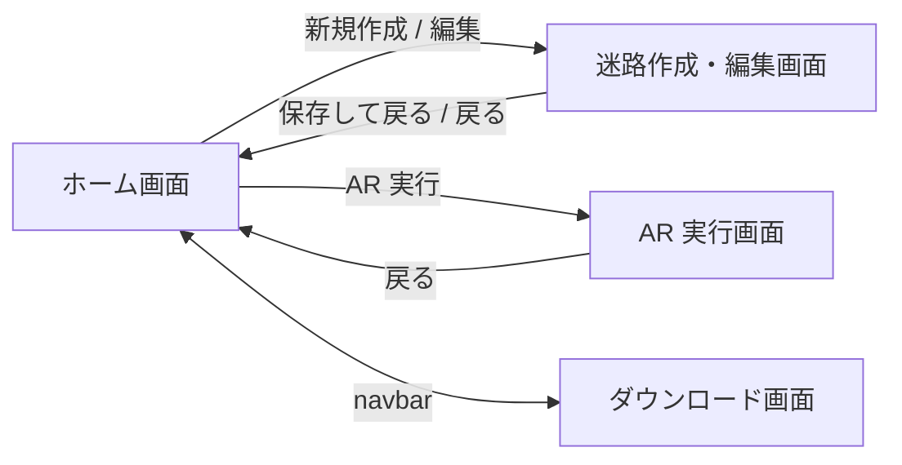
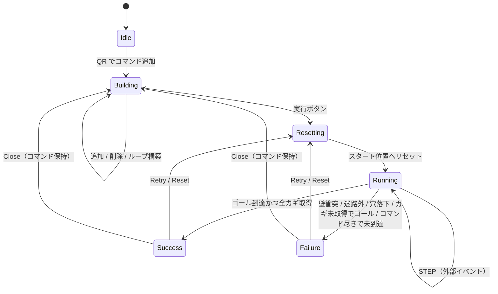

# 機能仕様

ProgPath（再開発版）の**画面別の機能・振る舞い**を定義する。各画面の「目的 / 構成要素 / 主要な振る舞い / 状態遷移 / エッジケース」を記述し、実装・設計判断の拠り所とする。

- 対象読者: 新規開発者、および設計判断の参照者（人・AI）。
- 記述の方針: **振る舞い中心**。FSD のスライス名・コンポーネント名には最小限しか踏み込まず、詳細は [directory-structure.md](./directory-structure.md) に委ねる。
- 上位の「何を作るか」は [requirements.md](./requirements.md) を正とする。本書はその画面・振る舞いへの落とし込み。
- 用語は [glossary.md](./glossary.md) に統一定義する（整備中）。

> 〔要確認〕が付いた値・挙動は暫定。実機検証・運用で確定させる。
> 数値・技術前提は to-be（**階層 1〜3 / サイズ 5×5〜7×7 / SQLite(WASM+OPFS) + TanStack DB / Tauri**）を正とする。

---

## 1. 全体像

### 1.1 画面一覧

| 画面 | 役割 | 位置づけ |
| --- | --- | --- |
| ホーム画面 | 迷路の管理（CRUD・フォルダ・QR 共有） | 入口 |
| 迷路作成・編集画面 | グリッドで迷路を構築・編集 | 補助価値（迷路エディタ） |
| AR 実行画面 | QR カードで命令作成し、AR で実行 | **★中心価値** |
| ダウンロード画面 | デスクトップ版の入手導線 | 配布導線 |

### 1.2 画面遷移

- どの画面からも navbar 経由でホーム／ダウンロードへ遷移できる。
- AR 実行画面・迷路編集画面へは、ホームで対象の迷路を選択している状態から遷移する。

### 1.3 確定したドメインルール（要約）

本書全体で前提とする中核ルール。詳細は各章に記す。

| 項目 | ルール |
| --- | --- |
| 迷路サイズ | 1〜3 階、各階 5×5〜7×7 |
| タイル種別 | 床 / 壁 / 穴 / スタート / ゴール / テレポート（上・下）/ カギ |
| スタート・ゴール | 迷路に各 1 つ必須 |
| ロボット初期向き | **南向きで固定**（迷路ごとに指定しない） |
| コマンド種別 | forward / turnRight / turnLeft / ifHole / loop（loopStart・loopEnd の対） |
| loop | **loopStart で開始・loopEnd で完了**の対。**多重ネスト可**。繰り返し回数 **2〜10**〔要確認〕 |
| ifHole | 前方に穴があれば埋める。**穴が無ければ何もしない（no-op）** |
| カギ | 踏むと**自動取得**（順不同）。全カギ取得がゴール条件 |
| テレポート | 上下階の同位置へ移動。**向きは維持** |
| 失敗条件 | 壁衝突 / 迷路外 / 穴落下 / カギ未取得でゴール到達 / コマンド尽きで未到達 |
| QR 共有 | **1 迷路 = 1 QR** を前提（収まらなければエラー） |

---

## 2. 共通要素

### 2.1 navbar（全画面共通）

**文脈スロットバー**。位置・高さを全画面で固定し、中身だけが画面ごとに変わる（寸法は [screen-specs.md](./screen-specs.md) 3）。

| 画面 | navbar | 左スロット | 中央 | 右スロット |
| --- | --- | --- | --- | --- |
| ホーム | あり | `⬡ ProgPath`（非ボタン） | **めいろ** | `⬇ アプリをいれる` |
| 迷路作成・編集 | あり | `← もどる`（保存ガード） | **めいろをつくる** / **なおす** | `✓ ほぞんして とじる` |
| **AR 実行** | **なし（没入）** | `← もどる` チップを画面左上に単独配置 | — | — |
| ダウンロード | あり | `← もどる` | **アプリを いれる** | 空（Tauri では状態表示） |

- **出口は画面ごとに 1 つ**にする。「navbar のホーム」と「ページ内の戻る」が両方あると、2〜3 人で操作している状況で「押した人と違う経路で抜ける」事故が起きる。
- **迷路編集・AR 実行を navbar の項目にしない**（ホームの子であってピアではない）。パンくずも置かない（最大 2 階層）。
- **AR 実行だけ navbar を消す**が、`← もどる` の位置は navbar 左スロットと揃えて学習を転移させる。
- Tauri で開いた場合、ダウンロードへの導線は **「アプリの じょうほう」** に意味を付け替える（→ 6.3）。

### 2.2 共通の表示方針

- 用語・アイコン・配色は全画面で一貫させる（→ [glossary.md](./glossary.md)）。
- 小学生（高学年）が迷わない情報量を保つ。操作前の説明・モーダルは最小限にする。
- **囲んでいる 2 人目・3 人目に届く文字サイズを使う**（本文 22px / 主要ラベル 30px、16px 未満禁止）。1 台を囲む外側の子の画角は「55 型 TV を 3m から見る」のとほぼ同じ（→ [design-tokens.md](./design-tokens.md) §7.1）。
- 具体的な寸法・配置は [screen-specs.md](./screen-specs.md) を正とする。
- ダイアログは画面中央にオーバーレイ表示する。確認系（削除など）は誤操作防止のため明示の確定操作を要求する。

### 2.3 エラー・失敗の表現

- **操作エラー**（編集時のタイル整合エラーなど）: 原因に応じたメッセージをダイアログで提示する。
- **実行失敗**（AR 実行でゴール不可）: 失敗ダイアログを揺れアニメーション付きで提示し、原因を伝える。
- 不正データは破棄して復旧する。チュートリアル（専用フォルダ＋教材迷路）は起動時に予約 ID で常に存在保証する（消しても次の保証で戻る。→ [requirements.md](./requirements.md) 5.5 / [db-design.md](./db-design.md) 7）。

---

## 3. ホーム画面 — 迷路管理

### 3.1 目的

保存済みの迷路を一覧・整理し、作成・編集・削除・AR 実行・QR 共有の起点になる。

### 3.2 構成要素

- **フォルダ一覧**: 迷路を分類するフォルダの一覧。**3 セクション固定**（🎓 チュートリアル / ユーザフォルダ群 / 📥 未分類）で、区切り線と位置で「動かせないもの」を示す。
- **迷路一覧**: 選択中フォルダ内の迷路カード。各カードは迷路名・サイズ・プレビュー（スタートのある階の俯瞰 2D）・**AR 実行の ▶ ボタン**を表示する。
- **詳細表示**: 選択中の迷路の詳細（迷路名・階層・サイズ・階層切替プレビュー）と、編集／削除／QR 共有／AR 実行への導線。**右からのスライドイン**で開く。
- **作成導線**: 新規迷路作成・フォルダ作成・QR 読み込みの起点。

**操作の割り当て**

| 操作 | 結果 |
| --- | --- |
| カード本体をクリック | 詳細をスライドインで開く |
| カードの **▶** | **AR 実行へ直行** |

- **▶ は常時表示**（ホバー表示にしない）。囲んでいる 2〜3 人のうちマウスを持っているのは 1 人だけなので、**ホバーは他の 2 人には存在しない状態**になる。「そこを押して」と指差せることが協調の前提。
- **起動時はチュートリアルフォルダを選択済み**にする。→ AR 実行まで **1 クリック**。
- **ソート・検索・表示切替を持たない**（更新日時の降順で固定）。1 クラス分の迷路に対しては選択肢そのものが負荷になる。
- **削除もリネームもできないフォルダ（= 未分類）には操作メニューを DOM から出さない**（グレーアウトしない）。**児童は無効表示を読まず連打する**。判定は `entities/folder` の `canManageFolder` が持ち、`FolderItem` がメニューを渡されても描かない（→ 3.4）。

### 3.3 迷路の管理（CRUD）

- 迷路の**作成・閲覧・編集・削除**ができる。
- 削除は確認ダイアログを経て実行する。
- 迷路データはローカルに永続化する（SQLite(WASM+OPFS) / TanStack DB、→ [db-design.md](./db-design.md)）。
- チュートリアル迷路は専用「チュートリアル」フォルダに常に用意される。**編集は不可だが削除はできる**（消しても次の存在保証で戻る。→ [db-design.md](./db-design.md) 7）。ユーザー作成の迷路が無いときは新規作成を促す表示を出す。
- **チュートリアル迷路は「編集」ではなく「コピーしてつくる」**（複製を未分類に作り、その編集画面へ入る）。Minecraft の Re-Create、Figma の Duplicate と同型。編集導線を出さないことで、**「なぜ編集できないのか」を説明する必要そのものが消える**。削除については説明が要らない — **消せるが戻る**ので、取り返しがつかない操作にならない。

### 3.4 フォルダ管理

フォルダで迷路を分類できる。フォルダは 3 種類あり、**種別ごとに許される操作が違う**。

#### 権限マトリクス

| 種別 | フォルダ削除 | リネーム | 中身の出入り | 中の迷路の編集 | 中の迷路の削除 |
| --- | --- | --- | --- | --- | --- |
| 未分類 | ✗ | ✗ | ✓ | ✓ | ✓ |
| チュートリアル | ✓ | ✗ | ✗（両方向） | ✗ | ✓ |
| ユーザフォルダ | ✓ | ✓ | ✓ | ✓ | ✓ |

- **「予約フォルダ」でひとくくりにはできない。** 未分類は「出入り自由だが箱は消せない」、チュートリアルは「箱は消せるが中身は読み取り専用」で、可否がほぼ真逆になる。だから 1 個のフラグではなく表で持つ（実装: `entities/folder` の `FOLDER_CAPABILITIES`）。
- **種別の判別は予約 ID の一致のみで行う**。永続フィールド（旧 `isDefault`）は持たない — ID と食い違う余地をなくすためと、`maze.folderId` しか手元にない呼び出し側でも判定できるようにするため（→ [db-design.md](./db-design.md) 3.1）。
- **チュートリアルは迷路の出入りを両方向とも禁じる**。外から入れることも、中から出すこともできない。これにより「中身は常に教材迷路 6 件の部分集合」という不変条件が成り立ち、「予約 ID なのに中身は自由」という中途半端な状態が生まれない。
- **チュートリアルフォルダは削除できるが、次の存在保証で戻る**。「消せない」と説明するより「消しても戻る」ほうが授業中の事故に強い（→ 3.6）。
- フォルダの**作成**は自由。**リネーム・削除**は上表に従う。
- 迷路は**ドラッグ＆ドロップ**でフォルダ間を移動できる（チュートリアルは対象外）。

#### フォルダを削除したとき

- **中の迷路も一緒に削除する。** 全フォルダ共通で、未分類への退避は行わない。
- undo は用意しない。代わりに**確認ダイアログ（`shared/ui` の `ConfirmModal`）に件数と「中の めいろも 消える」ことを必ず明記する**。「フォルダを消しますか」だけでは中身が消えることが伝わらない。
- チュートリアルフォルダを消した場合も同じで、フォルダと中の教材迷路がまとめて消える。ただし次の存在保証でフォルダごと復元される。

> **なぜ「未分類へ移動」をやめたか。** 移動方式だとチュートリアルフォルダを消したときに「空のチュートリアルフォルダ + 未分類に散らばった教材迷路 6 件」が生まれる。存在保証は迷路を **ID の有無だけ**で見るため（→ [db-design.md](./db-design.md) 7）、散らばった 6 件は「ある」と判定されて回収されず、フォルダだけが空で復活する。削除の意味を「フォルダの中身ごと消す」に統一すると、この破れが構造的に起きない。

### 3.5 QR 共有（エクスポート／インポート）

- **共有（エクスポート）**: 迷路データを QR コードに変換して表示する。
- **読み込み（インポート）**: カメラで QR を読み取り、迷路をローカルに追加する。
- **1 迷路 = 1 QR** を前提とする。データが 1 QR に収まらない場合はエラーを表示する〔要確認: 上限サイズ・圧縮方式〕。
- 読み込んだ迷路は未分類に追加する〔要確認〕。

### 3.6 エッジケース

- チュートリアル（専用フォルダ＋教材迷路）→ 起動時に予約 ID で常に存在保証（欠損すれば次回起動で復元）。構造不正のレコード → 破棄して復旧（→ [db-design.md](./db-design.md) 7）。
- **消えたチュートリアルをその場で戻す導線を用意する。** 「リロードして」は小学生に伝わらないため、ボタン 1 つで済ませる。挙動は**起動時とまったく同じ**（`ensureInitialData` を呼ぶだけ）で、正常なフォルダ・迷路は 1 件も消さない。**押しても起動時以上のことは起きない**ので、児童が触れる場所に置いてよい。**「初期化」という名前は使わない**（作ったものを消さないので挙動と合わない）。ボタンの配置・文言は #196 で決める。
- 同名の迷路・フォルダ → 重複を許容する（一意キーは内部 ID）〔要確認: 名称の最大文字数〕。

---

## 4. 迷路作成・編集画面

### 4.1 目的

グリッド上にタイルを配置して迷路を構築する。中心価値（AR 実行）を支える補助機能。

### 4.2 作成／編集の切替

- 遷移元の操作で**作成**か**編集**かが決まる（UI は共通）。
- 作成: 新しい迷路データを追加する。編集: 対象の迷路データを更新する。
- 作成時の初期状態: 1 階・既定サイズで、**左上にスタート / 右下にゴール**を初期配置する〔要確認: 既定サイズ〕。

### 4.3 構成要素

- **グリッド**: 迷路のマス。選択中のタイルを配置・編集する。
- **タイルパレット**: 配置可能なタイル一覧（下記 4.4）。**左サイドに 1 列 × 8 行・並び順固定**。8 種は一度に見せてよい選択肢の上限に収まるので、カテゴリ・タブ・検索を作らない。位置が変わらないことが「あのタイルはあそこ」の記憶を成立させる。
- **階層コントロール**: 階層の増減・切替・現在階の表示。**縦積み（3F が上・1F が下）+ ミニ盤面サムネ、既定は 1F**。屋内地図の Floor selector の推奨（縦積み / 建物の縦順 / 5 個以内 / 地上階を既定）に一致させる。
- **サイズコントロール**: 迷路サイズの増減・現在サイズの表示。
- **整合チェックリスト**: スタート／ゴール／テレポートの充足状態を常設表示（→ 4.7）。
- **保存／戻る**: 迷路名の入力と保存、ホームへの離脱。**navbar に統合する**（別のヘッダを持つと 1 マスが 67 → 59px に落ちる → [screen-specs.md](./screen-specs.md) 5.2）。

### 4.4 タイル種別

| タイル | 振る舞い |
| --- | --- |
| 床 | 通行可能な床。 |
| 壁 | 通行不可。forward で前方が壁 → 失敗。 |
| 穴 | 埋めていない穴に進入 → 落下して失敗。ifHole で埋めると床になる。 |
| スタート | ロボットの開始位置。**迷路に 1 つ必須**。 |
| ゴール | 到達目標。**迷路に 1 つ必須**。全カギ取得が到達条件。 |
| テレポート（上へ） | 上階の同位置へ移動。**向きは維持**。 |
| テレポート（下へ） | 下階の同位置へ移動。**向きは維持**。 |
| カギ | 踏むと自動取得。設置した全カギの取得がゴール条件。 |

### 4.5 階層・サイズ

- 階層: **1〜3 階**で増減・切替できる。
- サイズ: **5×5〜7×7** で増減できる。
- サイズ縮小時、範囲外になるタイル（スタート／ゴール等）は**自動で範囲内に再配置する**（警告を出して児童に対処させない）。「エラーを出させない」を優先する方針（→ 4.6）。

### 4.6 整合チェックとエラー

- **テレポート整合**: `shared/db` の共通検証（`validateTeleportLinks`）を使い、テレポート設置時および `MazeSchema` の入力検証で、移動先（上／下階の同位置）が次のいずれかならエラーにする。
  - 移動先の階が存在しない。
  - 移動先タイルが**壁／穴／テレポート**である。
- 反対向きのテレポートは必須にしない。編集 UI からの即時検証接続は #195 で行う。
- エラー内容に応じたメッセージを提示する。

#### オニオンスキン（隣接階の透過表示）

テレポートは「移動先の階に何があるか」を見ないと置けない。そのため **パレットでテレポート（うえへ／したへ）を選択した時点で自動的に隣接階を透過表示する**。

- 対象は**隣接 1 階層のみ**（うえへ → 上階 / したへ → 下階）。
- **25% グレーのハーフトーン**で描き、現在階の要素とは二重に描かない。上階は寒色寄り・下階は暖色寄りに振って方向を区別する。
- **モード選択を児童にさせない。** テレポート以外のタイルを選ぶと自動的に消える。

> 屋内 CAD（Revit のアンダーレイ）が 40 年来採ってきた定石で、「隣接 1 階層・ハーフトーン・上下 2 方向」の 3 点が共通する。自動 ON にすることで、児童に「表示モード」という概念を一切持ち込まずに済む。

#### エラーを「出させない」ための制約

エラーメッセージより、**そもそもエラーにならない操作**を優先する。

- スタート／ゴールは**シングルトン**（新しく置くと前のものが消える = 移動）。
- 3 階で「うえへ」、1 階で「したへ」は**パレット上でグレーアウト**する（パレットは位置記憶が重要なので、DOM から消さず無効表示にする数少ない例外）。
- サイズ縮小で範囲外になったタイルは**自動再配置**する（→ 4.5）。
- 文言は状態記述ではなく**行動指示**にする（「ゴールがありません」→ **「ゴールを おいてね」**）。

### 4.7 保存・バリデーション

- 保存時に最低限の妥当性を検証する〔要確認: 検証の厳密さ〕。
  - スタート・ゴールが各 1 つ存在する。
  - テレポートの整合が取れている。
- 検証に通らない場合は保存させず、原因を提示する。
- **検証状態は常設のチェックリストでライブ表示する**（✓ スタート / ✓ ゴール / ⚠ テレポート）。保存を押すまで結果が分からない状態にしない。
- **保存時にモーダルを出さない。** 保存押下時は該当セルの強調パルス + チェックリストの展開 + `aria-live="assertive"` で伝える。
- **保存ボタンを `disabled` にしない。** 押せないボタンだけでは、児童は「なぜ押せないか」と「次に何をすべきか」に辿り着けない。押させたうえで理由を返す（未完了ループでの実行ボタンと同じ方針 → 5.3）。

---

## 5. AR 実行画面（★中心価値）

QR カードで命令を組み立て、カメラ映像に重ねた 3D 迷路上でロボットを動かす、本アプリの中核画面。命令作成と実行を同一画面で行う。

### 5.1 目的

複数人で QR カードを分担して命令を作り、結果を AR で直感的に観察できるようにする。

### 5.2 構成要素

- **カメラ**: カメラ映像を背景表示。QR カードを読み取って命令を追加する。
- **3D 迷路（maze-3d）**: 迷路を 3D で描画し、カメラ映像に重ねる。各タイルを適切な 3D モデルで表示し、階層を 3D テキストで示す。
- **3D ロボット（robot-3d）**: ロボットを 3D で描画。コマンド・状況に応じてアニメーションする。
- **コマンドスタック**: 追加された命令の一覧。**画面右の縦レール**に置く。実行中のコマンドを強調し、オートスクロールする（→ 5.4）。ループのネストを字下げと終端キャップ行（`ここまで ×N`）で表す。
- **オーバーレイ群**: 移動カウント / ミニマップ / 階切替 / 各種ダイアログ（ループ回数入力・成功・失敗）。カメラ映像の**四隅**に置き、中央は視点操作のドラッグ領域として空ける。
- **実行コントロール**: スタート位置へのリセット、実行（順次実行）。一時停止中のみステップ実行を追加（→ 5.4）。

> **命令列は縦に積む。** 多重ループが確定仕様であるため横並びは採らない。横並びを採っている既存サービス（Lightbot / Cargo-Bot / RoboZZle）はいずれも別枠サブルーチンでネストを UI から追放しており、本アプリの前提とは異なる。
>
> **画面上に命令パレットを置かない**（理由 → 7.1）。

### 5.3 QR カードによる命令作成

#### コマンド種別

| コマンド | QR 文字列 | 振る舞い |
| --- | --- | --- |
| 前にすすむ | `forward` | 向いている方向へ 1 マス進む。 |
| 右にまがる | `turnRight` | 向きを右に 90 度回転。 |
| 左にまがる | `turnLeft` | 向きを左に 90 度回転。 |
| 穴をうめる | `ifHole` | 前方に穴があれば埋める。**無ければ no-op**。 |
| ループ開始 | `loopStart` | 新しいループの構築を開始する。回数入力ダイアログを表示。**多重ネスト可**。 |
| ループ終了 | `loopEnd` | 構築中の**一番内側**のループを完了する。 |

#### 追加・削除・追加位置

- QR を読み取ると、対応する命令を**位置選択された箇所**に追加する。
- 各命令の下に**位置選択ボタン**があり、追加先を選べる。既定は末尾。
- 命令は個別に削除できる。

##### 読み取りフィードバック

読み取った命令名を、**カードの実位置に出してから挿入位置へ飛ばす**。

1. `cornerPoints`（デコーダが返すカードの画面座標）の位置にチップを出す。
2. **300ms** かけてコマンドスタックの挿入位置へ移動させる。
3. **抑止時間（2 秒）と揃えて消える**。

> 画面中央への固定表示にしない。中央は 3D の主要領域であり、かつ「どのカードが読まれたか」が伝わらない。カードの実位置から飛ばすことで、**2〜3 人が同時にカードを出している状況でも「今のは誰のカードか」が分かる**。
>
> チップの寿命を抑止時間と揃えることで、**「消えた = 次を出していい」が視覚的な合図になる**。

##### 連続読み取りの抑止

- QR 命令を 1 回受理した後は、**同じ QR・別の QR を問わず 2 秒間**次の QR を受け付けない〔要確認: 授業での操作感に応じて調整〕。
- 抑止中の読み取りは、**直前と同じカードなら通知しない**（かざし続けているだけで取りこぼしではない）。**別のカードなら「はやすぎるよ」と通知**する（実際に取りこぼしている）。カメラは毎秒 10 回デコードするため、ここを区別しないと直前の結果表示が約 100ms で塗り替えられる。

#### ループの構築（開始 / 終了の対・多重ネスト対応）

ループは **`loopStart`（開始）と `loopEnd`（完了）の対**で構成する。開始から終了までの間に追加した命令群が、そのループの本体になる。構築は**スタック**で管理し、ネストを表現する。

- **開始**: `loopStart` を読み取ると**ループ回数入力ダイアログ**を表示する（表示中は QR 読み取りによる命令追加を停止）。回数確定後、新しいループをスタックに積み（push）、**構築モード**に入る。回数が範囲外の場合は `loopStart` を追加せず、入力待ちを維持して再入力できる。キャンセル時は `loopStart` を破棄して通常状態へ戻る。
- **本体の追加**: 構築モード中に追加した命令は、**スタック最上位（一番内側）のループ**の末尾に入る。既定の追加位置もそこになる。
- **完了**: `loopEnd` を読み取ると、**一番内側**の構築中ループを完了し、スタックから降ろす（pop）。スタックが空になれば構築モードを抜ける。完了は**読み取りフィードバックで通知**する（命令追加と同様。飛ばし先は閉じたループの終端キャップ行）— `loopEnd` は命令として積まれずコマンドスタックの中身が変わらないため、通知が無いと成否が分からない。
- **構築中ループの表示**: コマンドスタック上で、まだ完了していないループを**破線の枠と「まだ とじてないよ」バッジ**で示す。オーバーレイは数秒で消えるため、いつでも参照できる手がかりを常時残す。
- **多重ネスト**: 構築モード中にさらに `loopStart` を読み取ると、現在のループ本体の中に**新しいループをネスト**して開始する（スタックがもう 1 段積まれる）。
- 繰り返し回数は **2〜10**〔要確認〕。

##### 削除と異常系

- **ループの削除**: ある `loopStart` を削除すると、対応する `loopEnd` までの**ループ全体（内側にネストした命令群を含む）をまとめて削除**する。
- **対応しない `loopEnd`**: 構築中ループが無いときに `loopEnd` を読み取った場合は、命令を追加せず、**完了すべきループが存在しない旨を通知**する（命令追加表示と同様のオーバーレイで数秒提示）。
- **未完了ループ**: `loopStart` に対応する `loopEnd` が無い（構築モードのまま）状態では**実行できない**。［じっこう］ボタンは**押せるままにし**、押下時に**画面中央の警告ダイアログ**（残っている数と「『くりかえし おわり』のカードを読む」という次の行動を提示）を出して実行を抑止する。ボタンを disabled にしないのは、押せないボタンだけでは児童が理由と対処に辿り着けないため。

> 開始/終了を別カードにすることで多重ネストを明示的に表現できる。スタック表示は階層インデントで視認性を確保し、実行は内側ループを先に完了させる（後述 5.4）。

### 5.4 実行フロー

- 実行前に**必ずロボットをスタート位置・初期向き（南）にリセット**する。
- コマンド木を**先頭から順次実行**する。ループは開始時に平坦化せず、実行フレームのスタックでネストと現在位置を保持する。
- `stepExecution` は入力状態を変更せず、`{ state, events }` を返す。`state` が現在値の唯一の正で、`events` は描画・通知用の安定したドメインイベントである。
- `teleportUp` / `teleportDown` は、テレポート元へ進入する step と移動先へ解決する次の内部 step の 2 段階で処理する。
- Running 中の進行はタイマーではなく、表示側から送る `STEP` イベントで行う。アニメーション時間は後続の AR UI が制御する。
- 実行中のコマンドを**スポットライト方式**で強調し、コマンドスタックを**常に最上部へオートスクロール**する。カメラ映像上では背景輝度が一定しないため、発光色だけに頼らず周囲を沈める方式にする。
- 移動マス数をカウントし、カメラ左上にオーバーレイ表示する。
- ミニマップにロボットの現在位置・階層を反映し、テレポート後は表示階層を切り替える。
- 壁・迷路外への forward は位置を変えずに失敗する。穴への forward は穴マスへ移動して移動数を 1 加算した後に失敗する。
- 移動数は通常の進入（床・キー・ゴール・テレポート元）で 1 加算し、回転・穴埋め・テレポート先への解決では加算しない。

#### 実行速度

**速度切替を必須とする。**

| モード | 1 ステップ |
| --- | --- |
| ふつう（既定） | 600ms |
| はやい | 250ms |

- **40 ステップを超えたら自動的に「はやい」へ加速**する。3 段ネスト × 各 10 回 = 最大 1000 反復に達しうるため、等速では 1 授業に収まらない。
- ロボットの 3D アニメーション時間も同じ比率でスケールさせる（超えると次のステップが前のアニメーションを追い越す → [design-tokens.md](./design-tokens.md) §10.2）。

#### ステップ実行

**一時停止中のみ**「1 つずつ すすむ」を表示する。常時出すと実行コントロールが 3 個になり、「どれを押せばいいか」の判断が増える。

#### 状態遷移

### 5.5 成功・失敗の判定

- **成功**: ゴールタイルに到達し、かつ設置された全カギを取得済み。移動カウントとともに成功ダイアログを表示する。
- **失敗**（いずれか）:
  1. forward で前方が**壁**。
  2. forward で迷路外へ出ようとする。
  3. 埋めていない**穴**に進入（落下）。
  4. **全カギ未取得**のままゴールに到達。
  5. コマンドを**全て実行しても**ゴールに未到達。
- 失敗時は原因に応じたメッセージを、揺れアニメーション付きの失敗ダイアログで提示する。
- 実行エンジンは画面文言ではなく、`wall-collision` / `out-of-bounds` / `hole-fall` / `goal-before-keys` / `command-exhausted` などの失敗コードと座標メタデータを返す。

#### 失敗から修正への導線

**原因を伝えて終わらせない。「どの命令が悪かったか」と「次にどうするか」まで繋ぐ。**

1. **原因**を失敗コードに対応した行動指示の文言で示す（「かべに ぶつかったよ」）。
2. **該当命令へジャンプ**する導線を置く（押すとダイアログを閉じ、コマンドスタックの該当行を強調表示する）。
3. **「なおす」** を押すと、該当命令の直前を挿入位置として**事前選択した状態**にする。次に QR を読めばそこに入る。

> 失敗コードと座標メタデータは実行エンジンが既に返しているため、追加のドメインロジックなしに実現できる。**成功指標「補助なしで完遂できる割合 ≥ 80%」に対して最も効くのがここ**で、失敗のたびに教師を呼ぶ必要があるかどうかが分かれる。

### 5.6 ロボットの状態とアニメーション

- 向きは 4 方向（例: `(1,0)/(0,1)/(-1,0)/(0,-1)`）、階層は 1〜3 で管理する。
- 「前に進む／右に曲がる／左に曲がる／穴をうめる／穴に落ちる」に対応するアニメーションを、コマンド・状況に応じて実行する〔要確認: 1 動作あたりの所要時間〕。
- 高頻度更新は `useFrame` 内で ref 直接操作とし、`setState` を避ける（→ [CLAUDE.md](../CLAUDE.md) R3F 規約）。

### 5.7 プラットフォーム差異

- カメラ取得は `shared/camera` の `openCamera()` を利用し、Web / Tauri の分岐を画面へ持ち込まない。
- 画面表示時にカメラ取得を開始し、待機中は loading を表示する。許可操作が完了しない場合は **15 秒**でタイムアウトする。
- 取得失敗時は理由に応じた明示エラー・権限案内・再試行ボタンを表示する。カメラは AR 背景と QR 読み取りに必須とし、静止画 QR 読み取りや 3D-only 表示へのフォールバックは行わない。
- Tauri × Windows（WebView2）は未検証のため、secure context・許可 UI・OS 設定の挙動を Issue #175 Phase B で実機確認する。

---

## 6. ダウンロード画面

### 6.1 目的

デスクトップ版（Tauri）の入手導線を提供する。

### 6.2 構成要素

- アイコン・タイトル（「ProgPath デスクトップ版」）・説明文。
- **ダウンロードボタン**: デスクトップ版を配布元から取得する（配布元は [requirements.md](./requirements.md) 7 の確定後に定める）。
- **バージョン情報**: 最新バージョンとファイルサイズを表示する。

### 6.3 振る舞い

- 実行環境を判定し、**デスクトップアプリ上ではダウンロード不可**にして、その旨を表示する（Tauri 検出。旧実装の Electron 検出から引き直し）。
- Web 版ではダウンロード可能にする。
- **Tauri ではダウンロードボタンを DOM から取り除き、状態パネルに差し替える**（`disabled` にしない）。差分が CTA ブロックだけなのでレイアウトが跳ねず、「壊れた？」と思われない。
  - `disabled` を避ける理由: WCAG 1.4.3 は「無効な UI コンポーネントはコントラスト要件の対象外」と明記しており、教室のプロジェクタ投影や明るい窓際で最悪の読みにくさになりうる。かつフォーカス順から外れる。そして**児童は押せないボタンを連打する**。
  - Tauri 状態は**エラーではない**。赤いエラー色・`×` アイコン・警告三角を使わない。
- **Tauri では navbar の導線の意味を「ダウンロード」→「アプリの じょうほう」に付け替える**（→ 2.1）。「navbar からいつでも遷移できる」という要件を保ったまま、不可能な操作を誘わない。
- **この画面だけ読者が児童ではない。** 「先生・ICT ご担当の方へ」の表示を先頭に置き、他画面よりトーンを落とす。
- **バージョン・ファイルサイズはビルド時に埋め込んだ静的値を既定にし、配布元 API（GitHub Releases 等）は 2 秒タイムアウトで上書きするだけ**にする。学校ネットワークは Web フィルタで外部 API を遮断していることがあるため、**取得に失敗してもエラーを出さない**。

---

## 7. 横断仕様

### 7.1 認知負荷への配慮

- 操作前の説明・モーダルを最小化し、「やってみる」をすぐ始められる導線にする。
- 複数人が同時に手を動かせるよう、QR カードの分担と画面の見やすさを優先する。

#### `disabled` を原則使わない

**児童は押せないボタンを連打する。** 無効化は「押せない」しか伝えず、「なぜ」と「次に何をすべきか」を伝えないため、教師を呼ぶことでしか進めなくなる。

| 状況 | 採る手 |
| --- | --- |
| そもそも実行できない操作（Tauri でのダウンロード） | **DOM から取り除き**、状態表示に差し替える |
| 条件を満たせば実行できる操作（未完了ループでの実行 / 未検証での保存） | **押せるままにし**、押下時に理由と次の行動を返す |
| 位置記憶が重要な一覧の一部（パレットの「うえへ／したへ」） | **例外的にグレーアウト**（DOM から消すと並びが動く） |
| 削除もリネームもできないフォルダ（未分類）の操作メニュー | **DOM から出さない** |

> WCAG 1.4.3 は「無効な UI コンポーネントはコントラスト要件の対象外」と明記しており、`disabled` 表示は教室のプロジェクタ投影や明るい窓際で最悪の読みにくさになりうる。かつフォーカス順から外れる。GOV.UK Design System も "avoid them if possible" とする。

#### 画面上に命令パレットを再掲しない（AR 実行画面）

物理 QR カードは、カードの選択が画面のフォーカスに依存しないため、**マウスとは独立した第 2 の入力チャネル**である（Single Display Groupware の定義では、マウスとキーボードはフォーカスを共有するため同一チャネルと数える）。これが本アプリ最大の構造的な強み。

画面に命令パレットを出すと「画面で選ぶ → カードを探す」の順序が生まれ、**チャネルが 1 本に戻ってしまう**。画面には"選ばれた結果"だけを出す。

### 7.2 永続化

- 迷路・フォルダはローカル DB（SQLite / WASM+OPFS）に保存し、TanStack DB 経由でアクセスする（→ [db-design.md](./db-design.md)）。
- オフラインで読み書きできる。

### 7.3 未確定事項（〔要確認〕一覧）

| 箇所 | 内容 |
| --- | --- |
| 3.5 | QR の上限サイズ・圧縮方式 / 読み込み後の格納先 |
| 3.6 | 迷路名・フォルダ名の最大文字数（カード表示は全角 7 文字で truncate → [screen-specs.md](./screen-specs.md) 4.2） |
| 4.2 | 作成時の既定サイズ |
| 4.7 | 保存バリデーションの厳密さ |
| 5.3 | loop 回数の範囲（暫定 2〜10） |
| 5.3 | 連続読み取りの抑止時間（暫定 2 秒） |
| 5.4 | 実行速度の値と自動加速の閾値（暫定 600 / 250ms・40 ステップ） |
| 5.6 | 1 動作あたりのアニメーション所要時間 |

---

## 8. 関連ドキュメント

- [requirements.md](./requirements.md) — 要件定義（上位の「何を作るか」）
- [screen-specs.md](./screen-specs.md) — 画面ビジュアル仕様（本書の振る舞いを「何 px でどこに置くか」に落としたもの）
- [architecture.md](./architecture.md) — アーキテクチャ設計
- [directory-structure.md](./directory-structure.md) — ディレクトリ構成（スライス・コンポーネント詳細）
- [db-design.md](./db-design.md) — DB 設計（迷路・フォルダ・コマンドのデータ）
- [glossary.md](./glossary.md) — 用語集
- [CLAUDE.md](../CLAUDE.md) — リポジトリ運用指針
