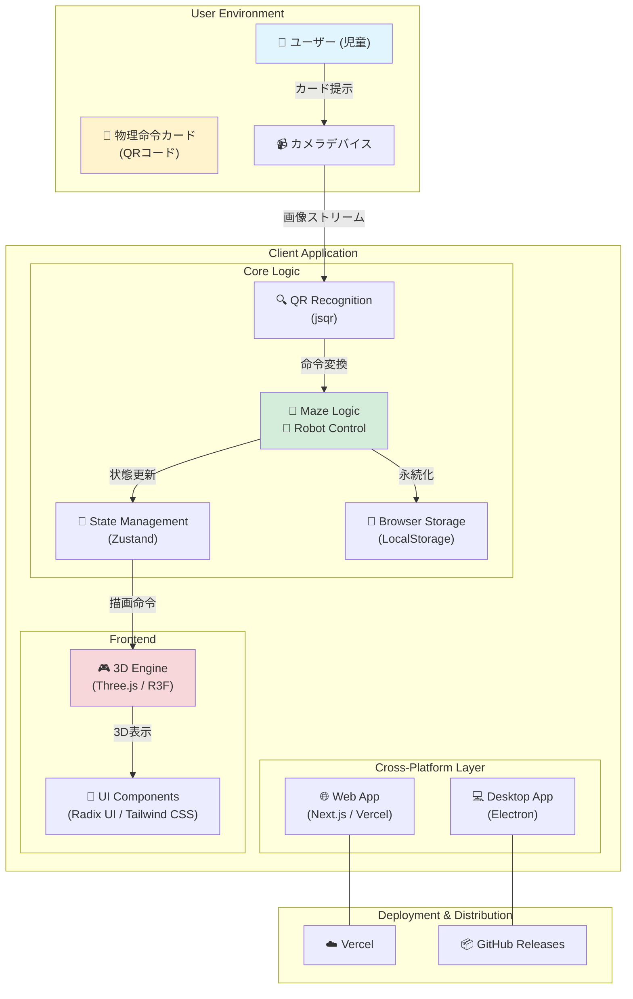

```mermaid
graph TB
    subgraph "User Environment"
        User["👤 ユーザー (児童)"]
        QRCards["📄 物理命令カード <br> (QRコード)"]
        Camera["📹 カメラデバイス"]
    end

    subgraph "Client Application"
        subgraph "Cross-Platform Layer"
            Web["🌐 Web App <br> (Next.js / Vercel)"]
            Desktop["💻 Desktop App <br> (Electron)"]
        end

        subgraph "Frontend"
            UI["🎨 UI Components <br> (Radix UI / Tailwind CSS)"]
            Renderer["🎮 3D Engine <br> (Three.js / R3F)"]
        end

        subgraph "Core Logic"
            QRScanner["🔍 QR Recognition <br> (jsqr)"]
            GameLogic["🧠 Maze Logic <br>  🤖 Robot Control"]
            State["💾 State Management <br> (Zustand)"]
            Storage["📁 Browser Storage <br> (LocalStorage)"]
        end
    end

    subgraph "Deployment & Distribution"
        Vercel["☁️ Vercel"]
        GitHub["📦 GitHub Releases"]
    end

    %% Data Flow
    User -->|カード提示| Camera
    Camera -->|画像ストリーム| QRScanner
    QRScanner -->|命令変換| GameLogic
    GameLogic -->|状態更新| State
    State -->|描画命令| Renderer
    Renderer -->|3D表示| UI
    GameLogic -->|永続化| Storage
    
    Web --- Vercel
    Desktop --- GitHub

    style User fill:#e1f5ff
    style QRCards fill:#fff3cd
    style GameLogic fill:#d4edda
    style Renderer fill:#f8d7da
```