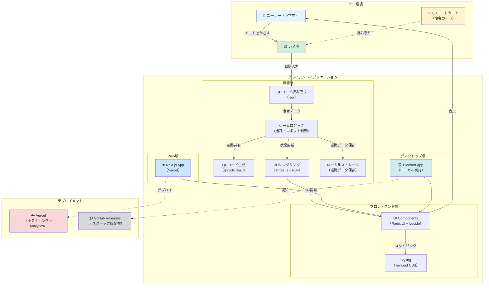

```mermaid
graph TB
    subgraph "ユーザー環境"
        User["👤 ユーザー（小学生）"]
        QRCards["📄 QRコードカード<br/>（命令カード）"]
        Camera["📹 カメラ"]
    end

    subgraph "クライアントアプリケーション"
        subgraph "Web版"
            WebApp["🌐 Next.js App<br/>（Vercel）"]
        end
        
        subgraph "デスクトップ版"
            ElectronApp["💻 Electron App<br/>（ローカル実行）"]
        end
        
        subgraph "フロントエンド層"
            UI["UI Components<br/>（Radix UI + Lucide）"]
            Styling["Styling<br/>（Tailwind CSS）"]
        end
        
        subgraph "機能層"
            QRReader["QRコード読み取り<br/>（jsqr）"]
            QRGenerator["QRコード生成<br/>（qrcode.react）"]
            Renderer3D["3Dレンダリング<br/>（Three.js + R3F）"]
            GameLogic["ゲームロジック<br/>（迷路・ロボット制御）"]
            Storage["ローカルストレージ<br/>（迷路データ保存）"]
        end
    end

    subgraph "デプロイメント"
        Vercel["☁️ Vercel<br/>（ホスティング + Analytics）"]
        GitHub["📦 GitHub Releases<br/>（デスクトップ版配布）"]
    end

    User -->|カードをかざす| Camera
    Camera -->|画像入力| QRReader
    QRCards -.->|読み取り| Camera
    
    QRReader -->|命令データ| GameLogic
    GameLogic -->|状態更新| Renderer3D
    GameLogic -->|迷路データ保存| Storage
    GameLogic -->|迷路共有| QRGenerator
    
    Renderer3D -->|3D描画| UI
    UI -->|スタイリング| Styling
    
    WebApp -.->|デプロイ| Vercel
    ElectronApp -.->|配布| GitHub
    
    WebApp --> UI
    ElectronApp --> UI
    
    UI -->|表示| User
    
    style User fill:#e1f5ff
    style QRCards fill:#fff3cd
    style Camera fill:#d4edda
    style WebApp fill:#cce5ff
    style ElectronApp fill:#d1ecf1
    style Vercel fill:#f8d7da
    style GitHub fill:#d6d8db
```